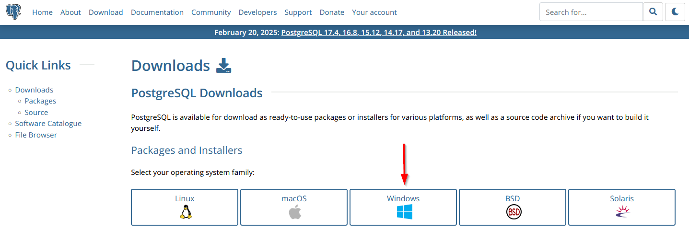
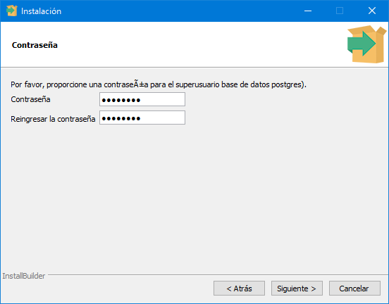
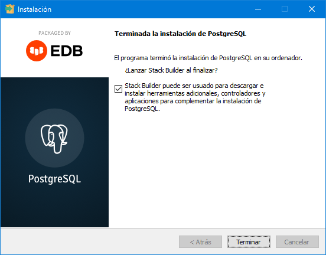
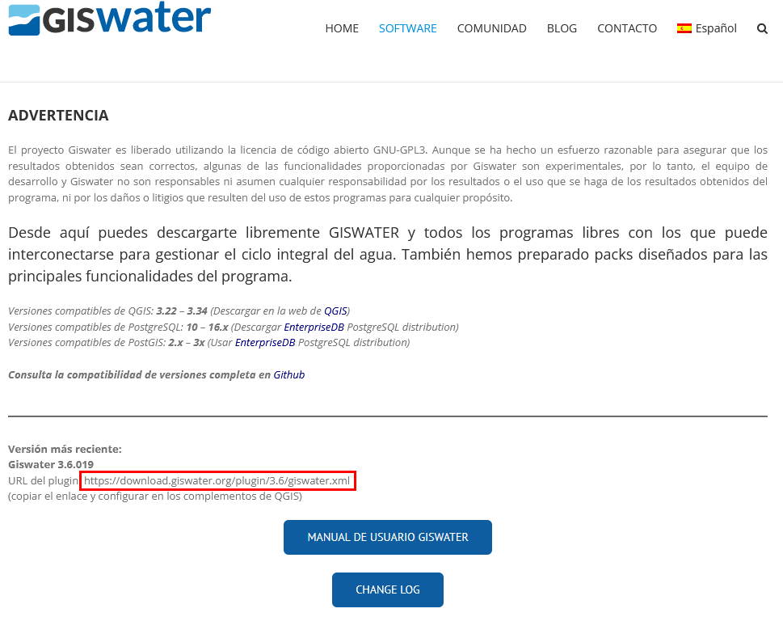

.. _installation-and-startup:

==============================
Installation and startup
==============================

.. only:: html

   .. contents::
      :local:

As we have seen in the section :ref:`what-is-giswater`, to be able to work with Giswater we have to have installed, at least, QGIS and PostgreSQL together with PostGIS.

PostgreSQL we can have it installed on our computer or on a remote server but QGIS we have to have it installed **mandatorily** on our computer.

Although it is not mandatory, it is recommended to have installed the database manager DBeaver as well as the simulation programs of the EPANET and SWMM networks.

.. attention::

     It is **mandatory** to check the `compatibility <https://github.com/Giswater/giswater_dbmodel/wiki/version-compatibility>`_ of versions of QGIS, PostgreSQL, Giswater, EPANET and SWMM.

.. note::

     To download the programs to use it is recommended to do it from the official pages of each of them.
     It can also be done from the download center of the `Giswater <https://www.giswater.org/descarga/>`_ web.

Installation of QGIS
===================

QGIS is the open source GIS program used to represent geographically the networks and interact with them.
To install it, we will go to the `download center of its official web <https://qgis.org/download/>`_ where, after skipping the donation window, we can download it.

.. figure:: img/installation-and-startup/download-qgis1.png
    
     Close the donation dialog window to the QGIS project.

QGIS is available for Windows, macOS, Linux, Android and iOS so we will have to select one or the other depending on our operating system. Once located, we can download it.

.. figure:: img/installation-and-startup/download-qgis2.png
    
     Download QGIS for Windows.

.. warning::

     To work with Giswater **mandatorily** we will download the LTR version of QGIS.

Once QGIS has been downloaded, we will run the downloaded file and follow the instructions to install it.

Installation of PostgreSQL and PostGIS
===================================

Installation of PostgreSQL
-------------------------

PostgreSQL is a relational database management system and open source where all the information used to work with Giswater is stored.

To install it, we will go to the `download center of its official web <https://www.postgresql.org/download/>`_ where we will have to select the package corresponding to our operating system.

     Download PostgreSQL for Windows.

After selecting the Windows option, in the next window we will have to click on *Download the installer* to be redirected to the EnterpriseDB web to be able to download some of the versions of PostgreSQL compatible with Giswater.

.. figure:: img/installation-and-startup/download-postgre2.png
    
     Download PostgreSQL compatible with Giswater.

Once PostgreSQL has been downloaded, we will run the downloaded file and follow the instructions to install it.

.. important::

     During the installation we will be asked to create a password for the superuser. It is very important to remember it as we will need to introduce it every time we connect to the database.

     Window to create password during installation.

During the installation pgAdmin (database manager program) and Stack Builder (administrator that allows us to install plugins to PostgreSQL and that we will use to install PostGIS) will also be installed.

Installation of PostGIS
----------------------

PostGIS is a PostgreSQL extension that allows us to provide the database with the spatial component and we can install it thanks to Stack Builder.

After completing the installation of PostgreSQL we will see a window that informs us of it and gives us the possibility to launch Stack Builder.

     Window of the completion of the installation of PostgreSQL and launch of Stack Builder.

When we click on the *Finish* button, the Stack Builder window will open directly where we will have to select the PostgreSQL version on which we want to install PostGIS.

In the next window, we will have to expand the *Spatial Extensions* category and mark the corresponding box to be able to install PostGIS.

.. figure:: img/installation-and-startup/install-postgis.png

     Installation of PostGIS.

With the box marked, we will click on the *Next* button and follow the instructions to continue with the installation. Once finished, we will click on the *Finish* button of Stack Builder and we will already have installed PostGIS.

Installation of Giswater
=======================

Giswater is developed as a QGIS plugin hosted in a own repository.
To be able to install it we will go to the *Plugins / Manage and install plugins* menu in QGIS and we will start by creating a connection to the repository where it is hosted to be able to download it.
The connection URL to the repository where we can download the latest version can be found in the `download center of its official web <https://www.giswater.org/descarga/>`_.

     URL of the latest version of Giswater.

If necessary, we will also have available previous versions.

What we will have to do is copy the URL that is marked in red in the previous figure and paste it in the window to create a new repository.

.. figure:: img/installation-and-startup/create-repository.png

     Create new repository in QGIS.

With the repository created, we will look for it in the *Uninstalled plugins* section and install it as any other QGIS plugin.
Once the installation has finished, we will be able to see it listed together with the other installed plugins.

.. figure:: img/installation-and-startup/giswater-installed.png

     Giswater installed.

After the installation we will see that a new button has been created in the toolbars as well as a new menu.

Installation of Dbeaver (optional)
=================================

As we have commented at the beginning of this section, during the installation of PostgreSQL pgAdmin (database manager program) is also installed.
Although it would not be necessary to install any other manager since the installed one meets the necessary requirements to manage the databases,
we recommend the installation of DBeaver given that its graphical interface is more user-friendly and easier to handle than the one of pgAdmin.

To download it we will go to the `download center of its official web <https://dbeaver.io/download/>`_ where we will select the installer corresponding to our operating system (Windows, Mac OS X or Linux).
Once the installer has been downloaded, we will run it and follow the instructions shown on screen to be able to install it.

Installation of EPANET (optional)
================================

EPANET is a program developed by the Environmental Protection Agency (EPA) of the United States which allows simulating the hydraulic and quality behavior of water in water distribution networks and 
is used by Giswater to perform hydraulic simulations.

To install it we will go to its `official web <https://www.epa.gov/water-research/epanet>`_ where we will navigate through the page until we locate the file we have to download to be able to install it.

.. figure:: img/installation-and-startup/download-epanet.png

     File to download to install EPANET.

Once the installer has been downloaded, we will run it and follow the instructions shown on screen to be able to install it.

Installation of SWMM (optional)
==============================

SWMM is a program developed by the Environmental Protection Agency (EPA) of the United States which allows simulating the sanitation and urban drainage networks in urban areas.

To install it we will go to its `official web <https://www.epa.gov/water-research/storm-water-management-model-swmm>`_ where we will navigate through the page until we locate the file we have to download to be able to install it.

.. figure:: img/installation-and-startup/download-swmm.png

     File to download to install SWMM.

Once the installer has been downloaded, we will run it and follow the instructions shown on screen to be able to install it.    

.. warning::
    
     The versions to use of EPANET and SWMM will always be the **original versions in English**.
