==============================
Modelo de datos de Giswater
==============================
Topología arco nodo
=======================

La topología **arco-nodo** es un modelo utilizado en sistemas de información geográfica (SIG) para representar relaciones 
espaciales entre elementos vectoriales.

Se compone de dos elementos básicos:

*Nodos:* Puntos que definen el inicio, fin o conexión entre segmentos (arcos). 
Actúan como "uniones" críticas, como intersecciones o vértices en redes (pozos, reservorios, válvulas, bombas).

*Arcos:* Líneas rectas o curvas que conectan nodos, representando elementos lineales ( tuberías, colectores o canales ).

**Relaciones clave:**

1. Cada arco comienza y termina en un nodo.
2. Los nodos garantizan conectividad y adyacencia.

Elementos que conforman las redes
======================================
Una de las características más atractiva y representativa de Giswater es la gran cantidad de elementos 
que se pueden representar en el entorno de trabajo, un hecho que permite una representación de la realidad muy 
ajustada y que el usuario pueda satisfacer todas sus necesidades al respeto de las condiciones de la red que gestiona.

En este apartado se desarrollará la funcionalidad de los principales elementos existentes, que se representan visualmente en la imagen. 
Aquí se representan la mayoría de elementos, aunque luego veremos que existen algunos más.

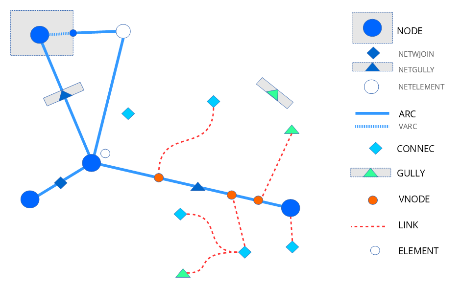
  
 *Representación esquemática de los distintos elementos existentes en Giswater*

 **Node**

Es uno de los tipos de elemento principal de la red (ver Imagen . Elementos de la red segun su Nivel) . Siempre se rige por reglas 
topológicas. Los elementos tipo nodo se han dividido en multitud de categorías, diferenciadas para proyectos WS y UD. Siempre son 
representados como puntos, aunque algunos pueden tener asociados polígonos que representen su perímetro real cuando este sea importante.

Los nodos siempre se sitúan entre dos arcos, por lo tanto, rompen estos arcos en diferentes entidades. 
La mayoría de elementos ejercen funciones específicas para romper (como reducciones de caudal o válvulas de chequeo), aunque hay 
nodos que habitualmente no romperían arcos, en algunos casos especiales deben ejercer esta función.

* Netwjoin: es una acometida (connec) que por sus dimensiones u otras características forma parte de la red y se sitúa encima de un arco.

* Netgully: es un embornal (gully) que por sus dimensiones u otras características forma parte de la red y se sitúa encima de un arco.

* Netelement: se trata de cualquier elemento que habitualmente no se conecte a la red pero que por sus características deba situarse encima de un arco y cortarlo.

**Arc**

Los arcos, junto con los nodos, son los principales elementos de la red (ver Imagen . Elementos de la red segun su Nivel). 
Estos se sitúan entre dos nodos y representan los conductos y cañerías de la red. No hay tantos tipos de arcos como de nodos, 
aunque también se encuentran categorizados y todas sus características (como puede ser diámetro, material, rugosidad…) 
pueden añadirse en su tabla de atributos para diferenciarlos mejor.

**El funcionamiento de los Varc (arcos virtuales)** .
Estos conectan la red topológicamente entre arcos y nodos cuando en la realidad un arco llega a un polígono y por lo tanto 
no existe realmente como arco. Esto es necesario para que las reglas de topología funcionen correctamente en la red Giswater. 
Normalmente son tramos cortos.

**Connec**

Hablamos de las acometidas, los elementos que conectan la red con edificios u otros elementos como por ejemplo fuentes. 
Se trata de elementos puntuales, aunque para relacionar las acometidas con el resto de la red se usan links y nodos virtuales.

**Gully**

Representan los embornales que no se sitúan encima de arcos, los que se encuentran a cierta distancia de la red. La mayoría 
son de este tipo; el resto son los netgully y se representan como nodos. También son elementos puntuales y, como las acometidas, 
se pueden relacionar con la red mediante links y nodos virtuales.

**Vnode**

Son nodos virtuales, que, igual que los arcos virtuales, no existen en la realidad, pero deben existir en la red de Giswater 
para que esta funcione correctamente. Los nodos virtuales se sitúan siempre encima de arcos, pero, al contrario que los nodos, 
nunca dividen los arcos en dos partes.

La función de estos elementos es la de situar encima de la red los embornales y las acometidas que se encuentran a cierta distancia. 
Se trata de elementos puntuales que, como se ha dicho, se representan encima del arco más cercano al elemento al que hace referencia 
el nodo virtual.

**Link**

Los links son elementos lineales que unen los embornales y las acometidas con sus nodos virtuales encima del arco más cercano, 
por lo tanto, ejercen la función de conectar los elementos separados con la red.

**Element**

Esta categoría está disponible para otros tipos de elementos puntuales no conectados con la red, que el propio usuario puede 
personalizarse. Puede tratarse de accesorios de la red o cualquier otro elemento que sea necesario para una representación con 
el mayor grado de realidad posible.

Además de todos estos elementos principales, hay algunos otros elementos que no tienen ninguna topología pero que son 
interesantes para visualizar en el mapa:

* Address: dentro de este grupo de elementos se encuentran todos los relacionados con la propia representación del territorio de la red. Normalmente se cuenta con las capas de eje de calle, límite municipal, perímetro de los edificios y portales.

* Dimensions: por último, debemos hacer mención a la capa que representa las dimensiones. Esta solo se rellenará cuando el usuario utilice la herramienta específica para medir distancias entre elementos. Sirven como complemento de la red para poder ver detalladamente las acotaciones creadas.

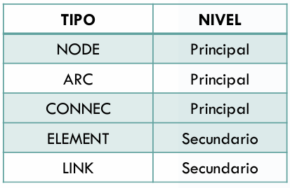
    
    *Imagen .Elementos de la red segun su Nivel*

Catálogos
===============
Los catálogos son una de las principales características y virtudes de Giswater. Estos permiten una organización 
y orden de la información básica y hacen posible que algunas relaciones de valor estén fijadas por registros que se 
definen en un catálogo. 

Trabajan mediante el concepto de **Forgein Key:** si un valor no se encuentra en la tabla foránea 
(tabla que define valores de manera previa), no se podrá 
introducir. Es decir, estos catálogos permiten definir información de previo 
para que este valor sea el único aceptado en una tabla de uso posterior.

Los catálogos representan los tipos de nodos, arcos y otros elementos que tiene en su red, así como contiene información 
sobre sus materiales y geometrías u otras características importantes de esos elementos.
   
Existen diversos tipos de catálogos en Giswater:
 * Objetos de red.
 * Materiales.
 * Gestión.
 * Modelo hidráulico.
 * Elementos adicionales.

Zonas del mapa
==============
Para saber hasta dónde llegan las redes de abastecimiento y drenaje de agua, Giswater establece distintas zonas que limitan 
los territorios del que forman parte. Cada una de estas zonas tiene unas características concretas y existen ciertas relaciones 
entre ellas, gestionadas, con llaves foráneas.

(La Imagen zonas del mapa) sirve para conocer el rol que juega cada una de estas zonas y los elementos con los que se relaciona.

ZONAS DEL MAPA **ABASTECIMIENTO**

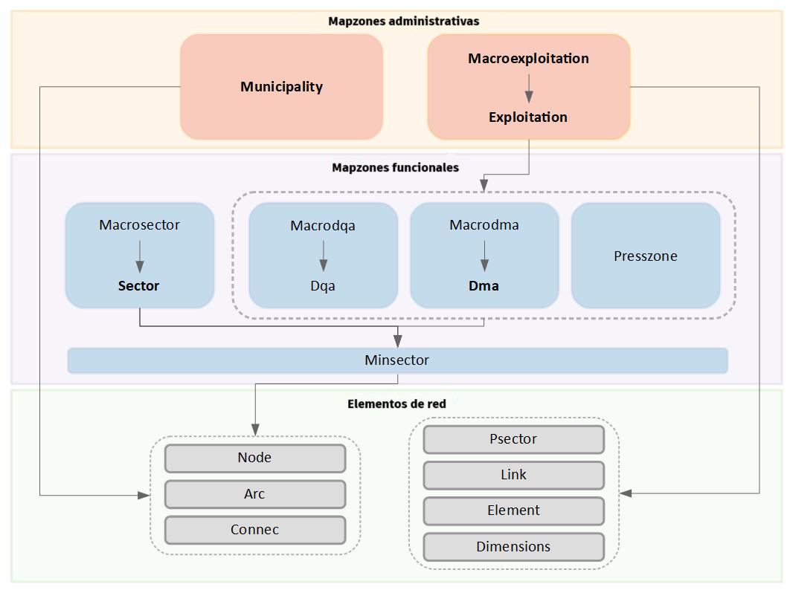

ZONAS DEL MAPA **SANEAMIENTO**

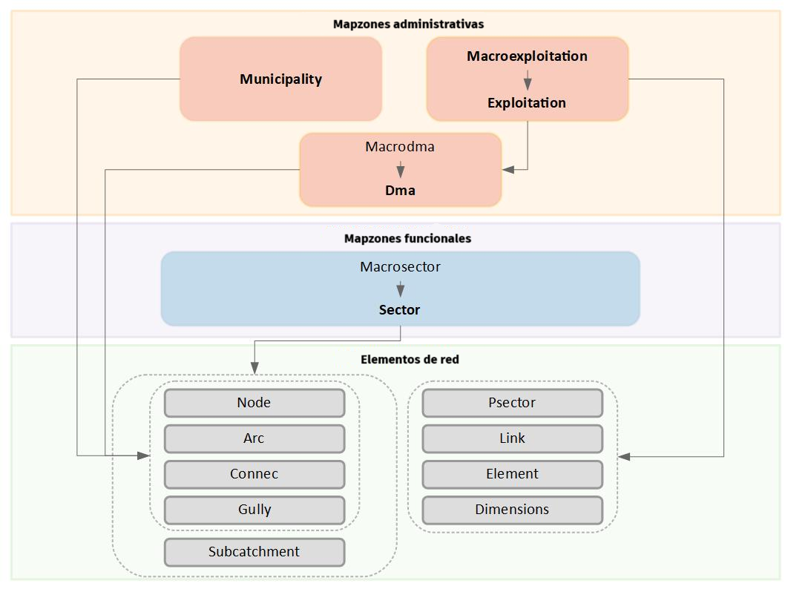

*Imagen . Esquema representativo de las distintas zonas del mapa y los elementos que pueden pertenecer a estas*

Las zonas principales son *Sector y Exploitation*, que sirven como cabezas del resto de zonas del mapa, cada uno dentro 
de su actividad. Los sectores se delimitan teniendo como única condición la coherencia hidráulica y pueden tener grandes 
diferencias en su extensión. Un solo sector puede, por ejemplo, representar una sola calle o representar todo un municipio 
en función de las necesidades de cada entidad gestora. Lo único necesario es que el sector tenga un lugar o varios de entrada 
de agua y un lugar o varios de salida de agua. De distinto modo, las explotaciones tienen un abasto más vinculado al territorio 
y están formados por macrodmas y dmas.

Todos los elementos principales del proyecto deben situarse tanto dentro de un sector como de una explotación. 
Como se representa en la Imagen (La Imagen zonas del mapa), algunos sólo tienen relación con la explotación y sólo los 
*subcatchment* deben estar indispensablemente dentro de un sector. 
En ningún caso un elemento puede no tener relación con alguna de las zonas del mapa.

Reglas Topologicas
===================
La definición de topología geoespacial dice: “La topología expresa las relaciones espaciales entre características 
de vectores (puntos, polilíneas y polígonos) conectados o adyacentes en un GIS.” Una vez conocido el significado, 
veremos algunas de las principales características topológicas que son importantes para el uso de Giswater en su rama GIS.

Introduciendo la topología de estados
-------------------------------------------
Antes de ver las reglas topológicas habituales, hay que tener en cuenta que Giswater tiene ciertas condiciones en 
relación con los estados de los elementos, lo que denominamos topología de estados. En la siguiente tabla se pueden 
ver todos los tipos de modificaciones (insert o update) entre elementos arco y nodo y si se podran llevar a cabo teniendo 
en cuenta el estado de los elementos. Encima de la tabla se pueden ver los distintos estados disponibles para los elementos en Giswater:

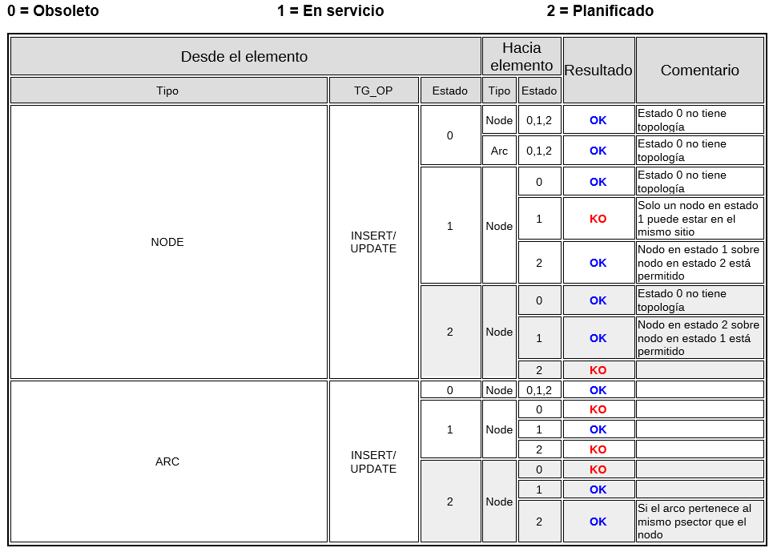

El tipo de estado que tiene unas condiciones más restrictivas es el **Planificado**. Operar con elementos en estado = 2 
solo será posible para usuarios con el rol de masterplan o superior y hay que tener en cuenta que el manejo de estos elementos 
puede romper la topología.

Primero de todo hay que tener como mínimo un registro en la tabla *plan_psector*, que sirve para gestionar las planificaciones. 
También es imprescindible tener un valor por defecto para psector. Los arcos y nodos con los que se opere se irán insertando con 
este valor por defecto en las tablas específicas: *plan_arc_x_psector* y *plan_node_x_psector*. Hay que revisar los campos state y 
doable.

Todos los elementos, ya sean nodos o arcos, que se encuentran en estado **En servicio** y el usuario los cambie 
manualmente a **Planificado**, se introducirán automáticamente en el psector por defecto que se tenga en este momento. 
Aunque este cambio está permitido por las reglas topológicas, no debería ser habitual pasar un elemento de estado 
*En servicio a Planificado*.

Comportamiento arc-node
-------------------------------
Las relaciones entre arcos y nodos son seguramente las más importantes a nivel topológico dentro de Giswater, 
en parte por el gran número de elementos que entran en juego. Para que el programa funcione correctamente hay que 
cumplir con estas reglas topológicas, y, en este sentido, el propio programa muestra mensajes al usuario cuando hay 
alguna regla importante que no se cumple.

El *plugin* de Giswater cuenta con una herramienta específica que permite detectar ciertos errores topológicos 
relacionados con los arcos y nodos. Más adelante veremos cómo se usa esta herramienta, pero en este apartado se 
explicarán las reglas topológicas en las que se hace hincapié:

* **Nodos huérfanos:** se trata de nodos que no conectan con ningún arco.

* **Nodos duplicados:** son nodos situados exactamente en el mismo lugar y por lo tanto generan una incoherencia en el sistema.

* **Consistencia topológica de los nodos:** hay algunas reglas topológicas específicas de Giswater, que tienen en cuenta el tipo de nodo. Por ejemplo, hay tipos de nodos que deben tener obligatoriamente conexión con tres arcos distintos, si no es así serán marcados como erróneos.

* **Arcos con el mismo nodo de inicio y fin:** los arcos siempre deben situarse entre dos nodos distintos (con *id* distinto), por lo tanto, un arco que empieza y termina en el mismo nodo es erróneo. Esto se puede configurar desde la tabla *config* y el campo *samenode_init_end_control*, donde si tenemos el valor *TRUE* el programa no permitirá arcos con el mismo nodo de inicio y de fin; si tenemos *FALSE*, estos nodos sí serán permitidos.

* **Arco sin nodo de inicio o fin:** se trata de un arco desconectado por alguno de sus extremos.

Comportamiento link
--------------------
Link es un enlace gráfico entre elementos del mapa. En este sentido, lo que hace un *link* es conectar un elemento 
de **entrada** (*connec o gully*, llamados también conexiones en general) con un elemento de **salida** (*arc, node, connec o gully*).

Los atributos que acompañan este enlace gráfico son:

* **Elemento de entrada**
        
   * **pjoint_id** - Identificador del punto de salida

   * **pjoint_type** - Tipo de punto de salida

   * **arc_id** - Identificador del tramo dónde finalmente conecta el elemento de entrada. Si el pjoint_type es ARC, pjoint_id y arc_id conicidirán.

* **Elemento de salida**

   * Para WS los tramos tienen una pestaña con sus elementos de entrada relacionados a través de arc_id.

   * Para UD, los tramos tienen una pestaña con sus elementos de entrada relacionados. Los nodos tienen una pestaña con sus elementos de entrada relacionados aguas arriba.

* **Link**

       * **feature_id** - Identificador del punto de entrada

       * **feature_type** - Tipo de punto de entrada

       * **exit_id** - Identificador del punto de salida

       * **exit_type** - Tipo de punto de salida

**Características especiales:**
    
    1. Respecto su elemento de **entrada** (que se encuentra aguas arriba), el link comparte la mayoría de sus atributos:

        * La visibilidad del mapa, es decir explotación y estado, lo toma de éste.

        * Si se borra el elemento de **entrada**, se borra el link (se considera que están funcionando como una unidad integrada).

        * Los atributos del link como pueden ser longitud, diámetro o material, se representan y manifiestan en el modelo de datos del elemento de **entrada** al que pertenece.

    2. Respecto su elemento de **salida** (el que se encuentra aguas abajo), ya no hay pertinencia sino simplemente topología, con lo cual:

     * Se gestiona topología. Si se mueve el punto de **salida** se mueve también el link. Si el punto de **salida** es desplazado a otro tramo, el campo arc_id del elemento de entrada se actualiza automáticamente.

     * Si el elemento de **salida** es un *connec* o un *gully* se copia el valor arc_id del tramo padre que tenga el elemento **salida**.

     * Los atributos de dma_id y fluid_type del elemento de **salida** se transmiten tanto al link cómo al elemento de **entrada**.

.. attention:: 
    Para proyectos de saneamiento (UD) los atributos dma_id y fluid_type pueden desacoplarse del elemento de salida. 
    Para ello se deben poner en *FALSE* las variables *Connect autoupdate dma y Connect autoupdate fluid* en la configuración.

**Formas de conectar con links**

Por defecto, al añadir un connec o gully, este se encuentra desconectado de la red. 
Para que exista topología entre la red y las conexiones deben crearse los links. Esto se puede hacer de las siguientes maneras:

    1. **Dibujar manualmente el link.** Este se puede dibujar, con la forma que uno quiera, siempre que se conecte un elemento de 
    entrada con uno de salida, mediante las herramientas habituales de dibujo en QGIS.

    2. **Herramienta de conectar a la red.** Usando la herramienta del complemento Giswater explicada en el apartado (Conectar con la red)
    se podran conectar una o varias conexiones al mismo tiempo. En este caso, el link siempre se dirgirá al tramo más cercano en línea recta.

    3. **Conectar automáticamente.** Existen variables de configuración para que, en el momento de introducir una nueva conexión, 
    esta se conecte automáticamente a la red. El resultado será el mismo que si conecta mediante la herramienta del complemento.

.. attention:: 
    En los formularios de las conexiones hay un botón (*Set arc_id*) que permite establecer previamente un arc_id. En caso de hacerlo, 
    las formas de conectar nº2 y 3 daran cómo resultado la conexión al tramo establecido y no al que se encuentre más próximo.

**Características de estado**
-------------------------------

**EN SERVICIO y OBSOLETO**

    * Sólo puede haber un link con estado EN SERVICIO para una conexión.

    * Podemos tener muchos links con estado OBSOLETO para una conexión.

    * Los valores de zonas del mapa, el exit_id y el exit_type se relacionan con las de la conexión.

**PLANIFICADO**

    * Para cada conexión en un psector se crea un link nuevo. Se puede crear manual o automáticamente.

    * Si el link se crea automáticamente, este se podrá modificar en la alternativa de psector dónde trabajemos. Nunca se modificará el link original.

    * No se permite eliminar el arc_id de una conexión planificada. Se deberá eliminar todo el link.

    * Los valores de zonas del mapa, el exit_id y el exit_type se visualizan independientemente de la conexión original, mostrando lo que transmite el link y la conexión planificada.

Elementos doble-geométricos
------------------------------------
Giswater hace uso de elementos doble-geométricos. Esto significa que un único elemento está formado por dos geometrías distintas, 
en este caso siempre son puntos que también pertenecen a un polígono.

Sólo algunos de los elementos de la red tienen esta particularidad, porque son tipos de elementos que pueden tener unas medidas mucho más grandes que las 
que se representan simplemente con un punto y por lo tanto nos interesará visualizar un polígono alrededor del punto.

 .. note:: Elementos doble-geometricos para WS
    **Tank, Register, Fountain**

 .. note:: Elementos doble-geometricos para UD
    **Storage, Chamber , Wwtp, Netgully, Gully**

Al añadir cualquier nodo nuevo de uno de estos tipos, se creará inmediatamente un polígono cuadrado asociado alrededor 
del elemento puntual. Las principales reglas topológicas de esta relación son:

    * Si se mueve el elemento nodo, el polígono asociado también se desplaza hacia la nueva posición del nodo.

    * Si se dibuja un nuevo polígono, con el perímetro que el usuario desee, alrededor de un nodo del mismo tipo, el nuevo perímetro sustituye directamente al antiguo.

    * No se puede dibujar un nuevo polígono sin que un nodo del mismo tipo se encuentre dentro de este.

    * Si se elimina un nodo con doble-geometría, el polígono asociado también será eliminado. En cambio, sí se puede eliminar el polígono sin modificar el nodo.

Para trabajar con este tipo de elementos doble-geométricos es importante tener una configuración que gestione su manejo. 
En la tabla *config* y en el campo *insert_double_geometry* se puede habilitar o deshabilitar esta función. 
En caso de tenerla habilitada (recomendado), mediante el campo *buffer_value* se asigna un valor por defecto 
a la longitud del costado del cuadrado poligonal. Como ya se ha dicho, este cuadrado se puede editar y darle la forma deseada.

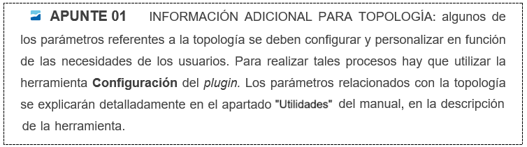

Configuración de ambiente
============================
El boton de *Configuración*

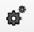
 
Este botón permite **definir valores por defecto** y configurar algunos parámetros que se aplican en otras herramientas o procesos.
Es importante que el usuario la conozca bien, ya que su uso es **recurrente**.

.. note::  Permite establecer el valor que se considere oportuno según las necesidades del proyecto, marcar el checkbox correspondiente y aceptar.

Este botón posee 5 pestañas con funciones distintas según el tipo de parámetro que se desea establecer:

1. **Básico**
    Permite configurar diferentes valores que se encuentran agrupados por Basic, O&M, Inventory, MasterPlan y Other.

   A continuación, se describen los valores más relevantes:

    * **State:** Define el estado por defecto de los elementos, generalmente OPERATIVE.
     
    * **State type:** valor asignado al tipo de estado, es configurable para cada state.

    * **Workcat_id:** Establece el valor por defecto para el expediente de alta.
     
    * **Builtdate:** valor por defecto para fecha de alta.

    * **Automatic link from connec to network:** permite dibujar el link automáticamente al añadir un nuevo connec.
 
    * **Force use docker for forms:** muestra formularios dockerizados.

    * **Force use docker  for info:** muestra formularios dockerizados al usar la info.

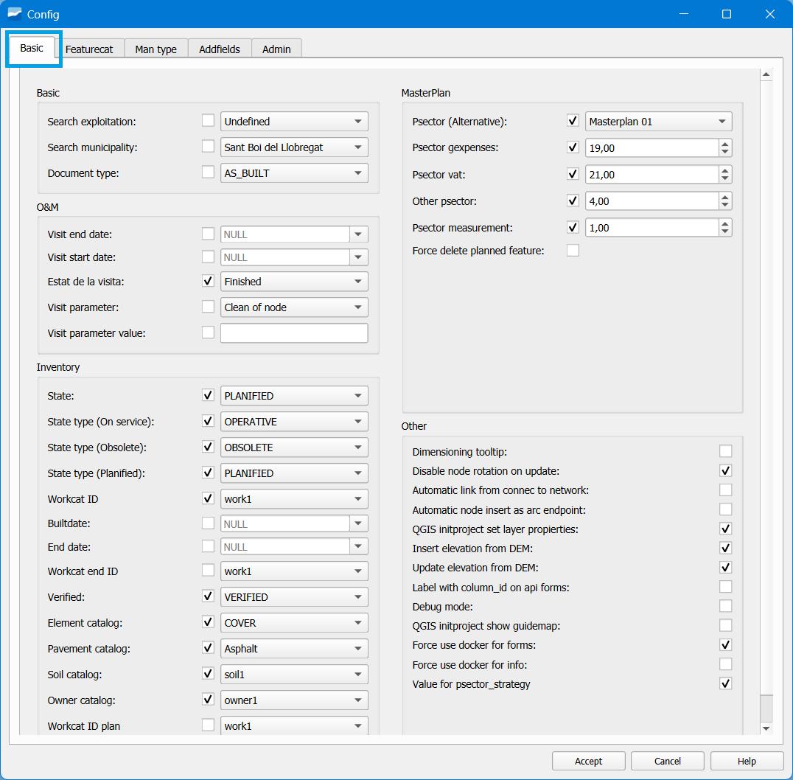
        
*Imagen . Configuración-Básico (Inventory-Otro)*

2. **Elemento de catálogo** *(feature cat)*
    Permite configurar **valores por defecto** del **catálogo** para distintos elementos de la red.
    Para cada uno de los elementos disponibles en cat_feature es posible **configurar un valor por defecto.** 
    Todo esto se aplica al utilizar la herramienta de **inserción**, donde los valores por defecto se utilizarán en el **catálogo del elemento** seleccionado.

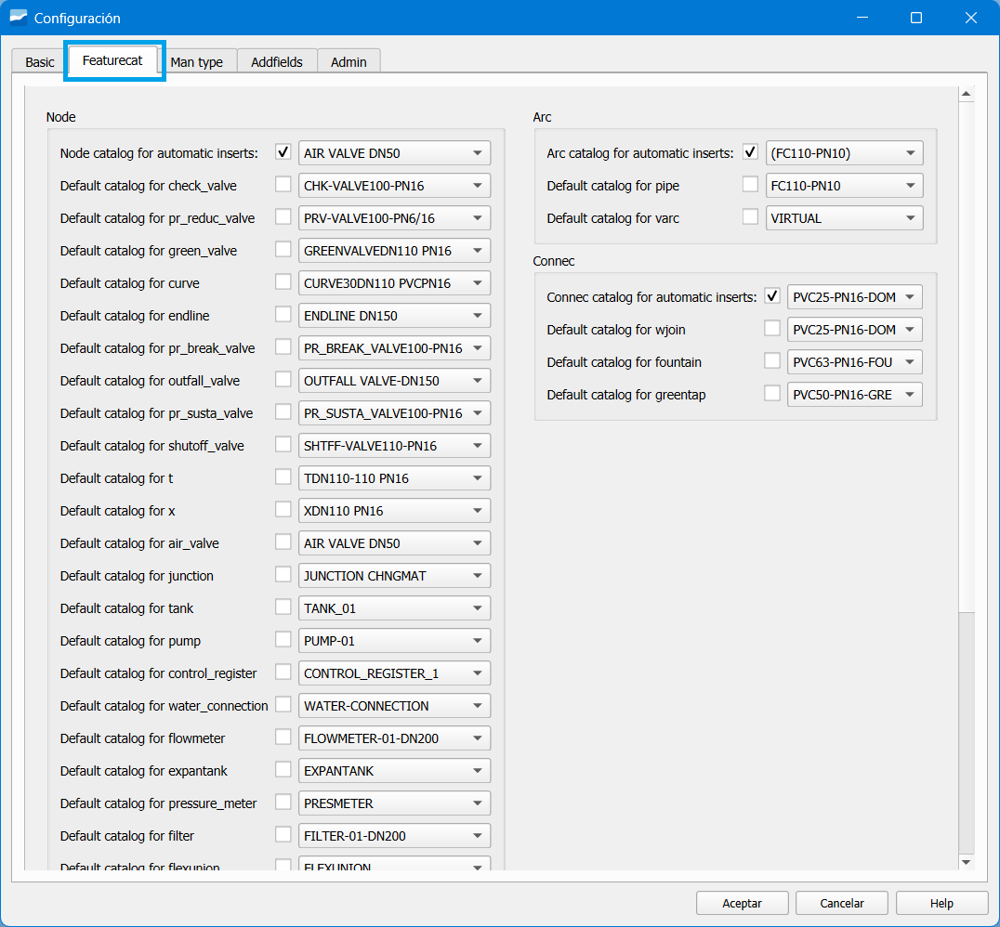

*Imagen . Configuración-Featurecat (Elemento de catálogo)*

3. **Man type**
    Es la configuración de valores por defecto de los campos de **dominio de valor:**

        * fluid_type
        * location_type
        * category_type
        * function_type

    Se puede configurar un valor por defecto **general para cada tipo de elemento.**
    También se puede definir un valor por defecto **específico para un tipo de objeto concreto.**

.. figure:: img/modelo-de-datos-giswater/config_amb_3.png

*Imagen . Configuración-Man Type*

4. **Campos adicionales** *(Addfields)*
    Se puede incluir atributos o información personalizada en los formularios de los elementos de la red.
    Estos campos son útiles para adaptar el modelo de datos a las necesidades específicas de un proyecto.

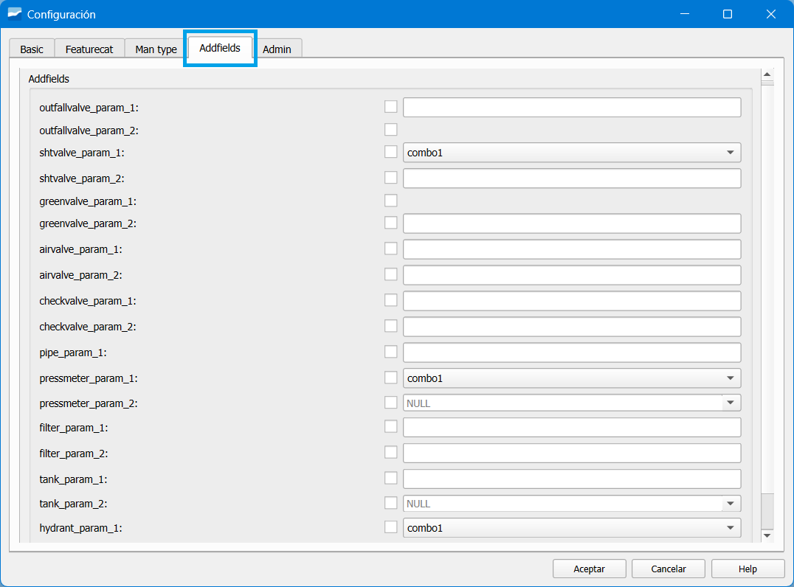

*Imagen . Configuración-Addfields (Campos adicionales)*

5. **Admin**
    Configuración de valores por defecto de los campos de dominio de valor:

     * Topology
        Estos ajustes garantizan la operación eficiente de las reglas topológicas, como la validación de nodos y arcos, 
        el manejo de geometrías dobles y la eliminación de nodos huérfanos. Además, incluyen configuraciones para buffers automáticos y validación de conectividad.

     * O&M (Operaciones y Mantenimiento)
        Configura herramientas esenciales para operaciones y mantenimiento, como zonificación dinámica, revisión automática de 
        tolerancia en nodos, cortes mínimos, y gestión avanzada de estilos para zonas de mapa.

     * Other
        Configura parámetros generales, como el manejo de unidades en modelos EPA y valores predeterminados, asegurando la 
        flexibilidad y adaptabilidad del sistema.

     * System
        Define configuraciones globales como valores por defecto en formularios, ajustes de monedas, gestión de etiquetas personalizadas,
         y parámetros avanzados para restricciones de usuarios y control del sistema.

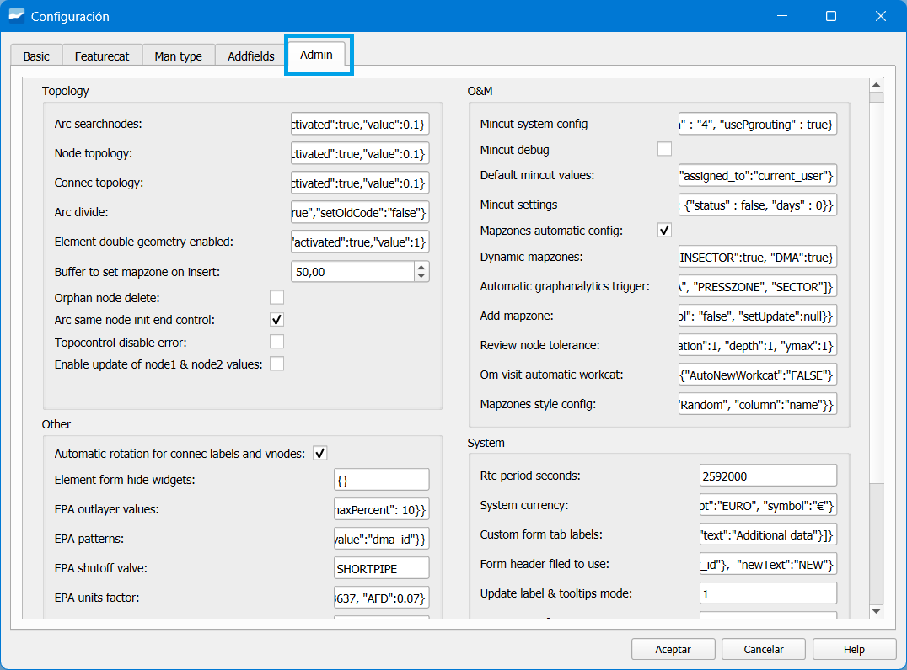

        *Imagen . Configuración-Admin*