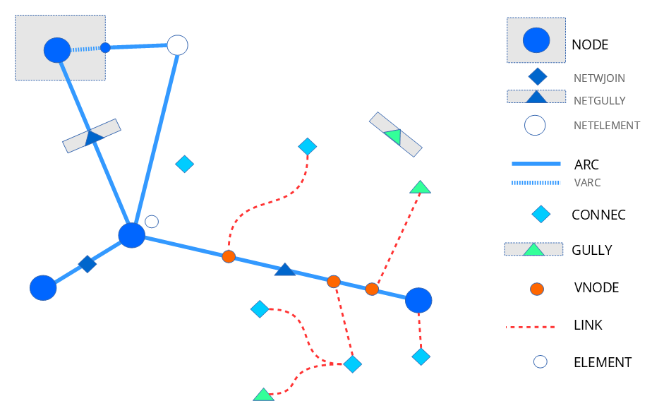
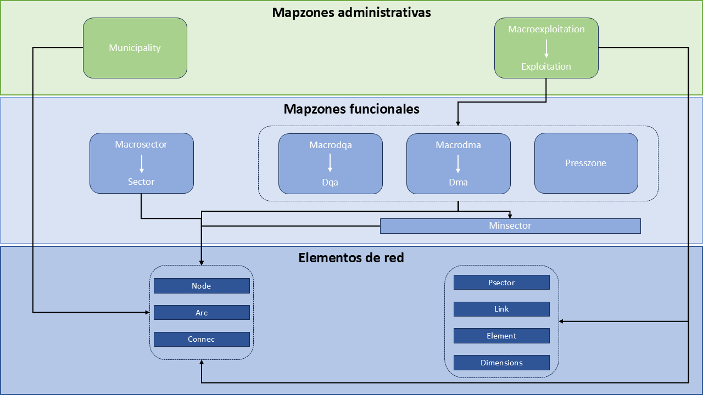
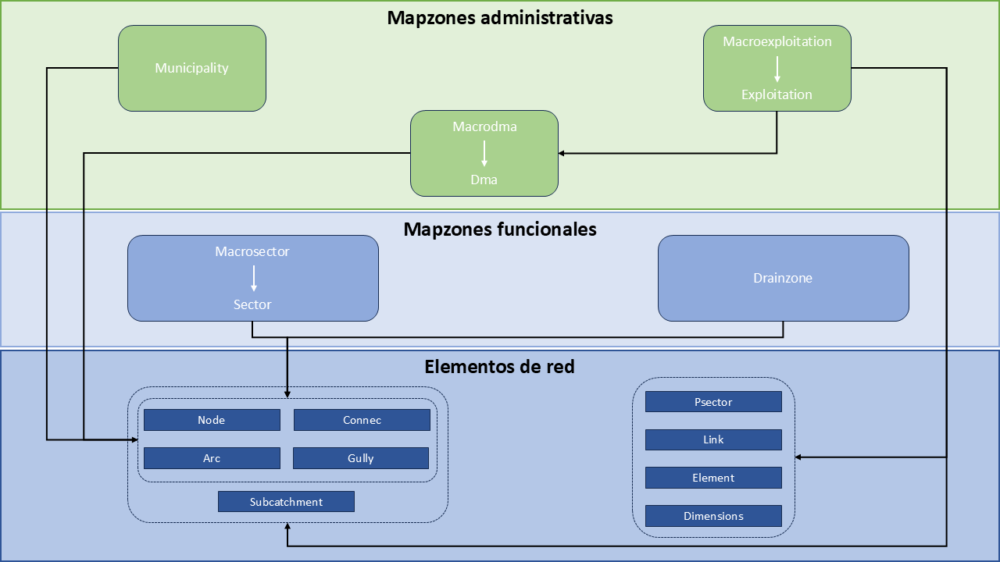
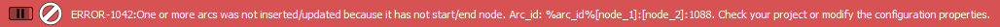

===========================
Modelo de datos de Giswater
===========================

.. only:: html

   .. contents::
      :local:

Una de las cualidades más destacadas de Giswater es la amplia variedad de elementos que pueden visualizarse en su entorno de trabajo.
Esto permite una reproducción muy fiel de la realidad, lo que facilita al usuario cubrir todas sus necesidades en relación con las condiciones de la red que administra.

Elementos que conforman las redes
=================================

Los elementos que conforman la red son todos aquellos que hacen referencia a los objetos físicos de la misma que pueden tener geometría
y que, por tanto, se pueden representar gráficamente en el mapa.

Todos ellos están relacionados entre sí a través de la topología de tal manera que deben seguir unas ciertas reglas topológicas para su correcto funcionamiento.

Gracias a las posibilidades de simbolización de QGIS podemos conseguir una representación de los diferentes elementos muy ajustada a la realidad.

A continuación, podemos ver un esquema básico de los tipos de elementos de las redes en Giswater.

  
   Representación esquemática de los distintos elementos existentes en Giswater.

Los principales objetos son:

- Node

Es uno de los tipos de elementos principales de la red, se rige por reglas topológicas y **siempre son los primeros que debemos tener**. Representan elementos puntuales de la red como, por ejemplo,
válvulas, hidrantes, uniones, contadores, depósitos... y se representan como puntos en QGIS.

Los elementos tipo nodo están divididos en multitud de categorías, diferenciadas para proyectos ws y ud.
Aunque siempre son representados como puntos, algunos pueden tener asociados polígonos que representen su perímetro real cuando éste sea importante (por ejemplo, depósitos).

Los nodos siempre se sitúan entre dos arcos y, por lo tanto, los rompen en diferentes entidades (partes).
Aunque la mayoría de nodos están configurados para que rompan los arcos, existen algunas excepciones en las que esto no sucede (por ejemplo, las ventosas).

Además de los nodos, en la figura podemos observar:

    - Netwjoin: acometida (connec) que por sus dimensiones u otras características forma parte de la red y se sitúa encima de un arco.
    - Netgully: imbornal (gully) que por sus dimensiones u otras características forma parte de la red y se sitúa encima de un arco.
    - Netelement: elemento que habitualmente no se conecta a la red pero que por sus características debe situarse encima de un arco y cortarlo.

- Arc

Es otro de los tipos de elementos principales de la red, también se rige por reglas topológicas y **son los segundos que debemos tener**. Representan elementos lineales de la red, es decir, las canalizaciones y 
se representan como líneas en QGIS. Todas sus características (diámetro, material, rugosidad...) pueden añadirse en su tabla de atributos.

**Cada tramo debe estar situado entre dos nodos obligatoriamente, con lo que se insertan o digitalizan después de los nodos**.

Existe un tipo de arco llamado *varc* o arco virtual que se utiliza para conectar topológicamente partes de la red. Este tipo de arco, que en realidad no existe como tal, nos permite dar continuidad y conectividad a la red 
sin romper la topología de la misma. El arco virtual es fácil de ver en los depósitos donde, para dar continuidad, debemos digitalizarlo entre el depósito y la entrada/salida del mismo.

- Connec

Elemento principal de la red que representa las acometidas, es decir, los elementos que conectan la red con edificios u otros elementos como, por ejemplo, fuentes. Se representan como puntos en QGIS.

No se ubican directamente sobre los tramos de la red principal sino que se conectan a ella a través de los links.

- Gully

Elemento principal específico de las redes de saneamiento y drenaje urbano que representa los imbornales y que se representa como un punto en QGIS.

Se suelen ubicar a cierta distancia de la red y se conectan a través de los links.

- Link

Elementos lineales secundarios que unen los imbornales y las acometidas con sus nodos virtuales encima del arco más cercano, 
por lo tanto, ejercen la función de conectar los elementos separados con la red.

- Element

Objetos puntuales que no están conectados a la red y que el usuario tiene la posibilidad personalizar.

Puede tratarse de accesorios de la red o cualquier otro elemento que sea necesario para una representación con el mayor grado de realidad posible.

.. _Catalogos:

Catálogos
=========

Son tablas de la base de datos con valores predefinidos que permiten organizar y ordenar información básica, de modo que restringen qué datos se pueden poner en ciertos campos, generando así relaciones de valores
fijadas por los registros concretos que se definen en estos catálogos.

Trabajan mediante el concepto de **clave foránea** o foreign key, muy habitual en bases de datos relacionales. Esto significa que la clave foránea establecida en una tabla no
permitirá la introducción de ningún valor que no esté previamente definido en otra tabla, en este caso, la tabla de catálogo.

Este concepto de clave foránea no solo se aplica a los catálogos sino también a muchos otros datos que deber ser trabajados por una relación fijada de valores para su adecuado funcionamiento.

Existen diversos tipo de catálogos en Giswater entre los que cabe destacar los de objetos de red, los de materiales, los de gestión, los de modelo hidráulico así como los correspondientes a elementos adicionales no topológicos.

**Para empezar a trabajar con Giswater debemos rellenar, como mínimo, los catálogos de objetos de red (al menos el de nodo y arco) y de materiales**.

Rellenar un catálogo se hace de manera análoga a como se crea un elemento en una tabla en QGIS:

- Se pone el catálogo en edición.
- Se añade una nueva fila.
- Se rellena con los datos necesarios.
- Se guardan los cambios y se deja de tener el catálogo en edición.

En :ref:`catalogs` podrás encontrar un listado con todos los catálogos disponibles en Giswater.

.. _Zonas del mapa:

Zonas del mapa
==============

Son áreas geográficas definidas en la red que permiten gestionar y administrar diferentes ámbitos o secciones.

Hay distintas zonas, cada una de las cuales tiene características y funcionalidades concretas. No solo permiten gestionar todo el ámbito de nuestra red
sino que también son muy útiles para establecer zonas que categoricen la red en función de determinadas características.
Cada elemento de la red tendrá diferentes atributos según a qué zonas del mapa pertenece de tal manera que esta relación se establece mediante claves foráneas igual que en los catálogos.

Además de relacionarse con los elementos de la red, algunas de estas zonas también se relacionan entre sí, ya que pueden tener dependencia unas de otras.

Todas ellas se deben representar geométricamente en QGIS mediante polígonos para que sean más fáciles de identificar.

Existen cuatro grandes bloques de zonas del mapa:

- Zonas del mapa administrativas: permiten agrupar elementos en un ámbito muy general y, normalmente, hacen referencia a los límites administrativos prefijados.
- Zonas del mapa operacionales: 
- Zonas del mapa comerciales (ws): 
- Zonas del mapa funcionales: son mucho más variables y, generalmente, más pequeñas. Guardan relación directa con la gestión hidráulica de la red.

Cabe destacar que, además de que se pueden dibujar manualmente, Giswater permite calcularlas de manera automática
gracias a un algoritmo que usa la configuración realizada y la trazabilidad de flujos para establecer el resultado de la zonificación sobre nuestra red.

Dado que Giswater permite gestionar redes de abastecimiento y de saneamiento y drenaje urbano, cada tipología de red tiene sus propias zonas del mapa.
En los esquemas que están a continuación se pueden apreciar las zonas del mapa para ambos tipos de red.

   Zonas del mapa para redes de abastecimiento.

   Zonas del mapa para redes de saneamiento y drenaje urbano.

En :ref:`zonas-mapa` podrás encontrar la definición de las zonas del mapa disponibles en Giswater.

Reglas de trabajo
=================

Giswater nos permite controlar dos tipos de reglas fundamentales. La primera, inherente a la topología arco-nodo de los GIS, expresa las relaciones existentes entre los puntos, líneas y polígonos
que están conectados entre sí en QGIS. La otra, propia de Giswater, es la referente al estado de los elementos ya que, dependiendo de su estado, podremos encontrarnos con ciertas restricciones
a la hora de insertar objetos nuevos en la red.

Para controlar estas reglas Giswater dispone de varias herramientas. Por un lado, si estamos insertando objetos nuevos en la red, si se rompe alguna de estas reglas obtendremos un aviso de la incoherencia cometida.
Por otro lado, si la red ya la tenemos insertada pero cuenta con errores topológicos, gracias a Giswater tenemos a nuestra disposición ciertas herramientas que permiten identificar dónde están los errores.
Este hecho es habitual cuando se migran redes de otras fuentes.

En aquellos casos en los que sea necesario, podremos desactivar la herramienta de control topológico (opción *Topocontrol disable error*).

Las reglas de trabajo de Giswater son:

Comportamiento arco-nodo
------------------------

Todos los nodos y arcos de la red deben estar conectados entre sí salvo contadas excepciones (por ejemplo, las ventosas en las redes de abastecimiento).

**Siempre** que dibujemos elementos nuevos **tendremos que configurar previamente las opciones de autoensamblado** de QGIS para asegurarnos de que la red está bien conectada.

Si no se digitaliza de manera correcta, Giswater mostrará un mensaje de error y no permitirá insertar el objeto.

   Error al digitalizar erróneamente un arco.

Giswater está configurado para que, si movemos un nodo, todos los tramos que están conectados a dicho nodo se muevan también. De esta manera, no se rompe la topología.

Además, en su caja de herramientas dispone de procesos específicos con los que podremos detectar, entre otros, arcos sin nodos inicial o final, nodos duplicados, nodos huérfanos...

Comportamiento link-red
-----------------------

El link es el enlace gráfico entre elementos del mapa. Lo que hace es conectar un elemento de entrada (*connec* o *gully*) con un elemento de salida (*arco*, *nodo*, *connec* o *gully*).

Al conectar el connec/gully con la red mediante el link, captura el valor del tramo relacionado de tal manera que queda enlazado en el campo *arc_id* que hay en el connec/gully.
En esta relación entre connec/gully, link y arco se cumplen varias reglas:

- Respecto su elemento de entrada (que se encuentra aguas arriba), el link comparte la mayoría de sus atributos:

  - La visibilidad del mapa, es decir la explotación y el estado, lo toma de éste.
  - Si se borra el elemento de entrada, se borra el link.
  - Los atributos del link como longitud, diámetro o material, se representan y manifiestan en el modelo de datos del elemento de entrada al que pertenece.

- Respecto su elemento de salida (el que se encuentra aguas abajo), ya no hay pertenencia sino simplemente topología. Por tanto:
  
  - Si se mueve el punto de salida, el link se mueve automáticamente.
  - Si el elemento de salida es un connec/gully, su valor de *arc_id* se transmite.
  - Si se actualiza el vértice final del link hacia otro tramo, se actualizará el campo *arc_id* del elemento de entrada.

Por defecto, al añadir un connec/gully, éste se encuentra desconectado de la red. Para que exista topología entre la red y las conexiones, deben crearse los links.
Esto se puede hacer de las siguientes maneras:

- Dibujar manualmente el link. Este se puede dibujar, con la forma que uno quiera, siempre que se conecte un elemento de entrada con uno de salida, mediante las herramientas habituales de dibujo en QGIS.
- Herramienta de conectar a la red. Usando la herramienta de Giswater *Conectar a la red* se podrán conectar una o varias conexiones al mismo tiempo.
  En este caso, el link siempre se dirigirá al tramo más cercano en línea recta.
- Conectar automáticamente. Existen variables de configuración para que, en el momento de introducir un nuevo connec/gully, se conecte automáticamente a la red.
  El resultado será el mismo que si se conecta mediante la herramienta del complemento.

Elementos doble geométricos
---------------------------

En Giswater existen objetos que, por sus características y para una mejor representación, tienen doble geometría (punto y polígono). Un ejemplo son los depósitos.

En estos casos, aparte del elemento puntual, también se puede usar la geometría poligonal de tal manera que se almacenará en otra capa pensada para ello.
Digitalizarlo será tan sencillo como dibujar el polígono alrededor del punto y quedará vinculado a él.
El polígono solo tendrá como dato el identificador del punto, que será el que cuenta con toda la información importante.

Esta relación tiene sus propias reglas topológicas:

- Si se mueve el punto, el polígono también se desplaza.
- Si alrededor de un punto se dibuja un nuevo polígono, el nuevo sustituye al antiguo.
- No se puede dibujar un nuevo polígono sin que un punto se encuentre dentro de éste.
- Si se elimina un punto con doble geometría, el polígono asociado también se eliminará.

Para trabajar con este tipo de elementos doble geométricos es importante tener una configuración que gestione su manejo. 
En el catálogo *cat_feature_* se puede habilitar/deshabilitar esta función mediante el campo *double_geom*.
Para ello, estableceremos su valor en *true* o en *false* dependiendo de que queramos o no queramos que Giswater nos dibuje el polígono asociado.
En el caso de que sí se dibuje, se representará un polígono alrededor del objeto digitalizado el cual podremos modificar según nuestras necesidades.

.. note::
  
   Elementos doble geométricos para **ws**: *Tank*, *Register* y *Fountain*.
    
   Elementos doble geométricos para **ud**: *Storage*, *Chamber*, *Wwtp*, *Netgully* y *Gully*.

Topología de estados
====================

Todos los objetos en Giswater pueden clasificarse en tres estados:

- Obsoleto (valor 0): estado en el que se encuentran aquellos elementos que formaban parte de la red pero que ya no están en uso.
- Operativo (valor 1): estado en el que se encuentran los elementos que conforman la red y están en funcionamiento.
- Planificado (valor 2): estado en el que se encuentran los objetos de la red que forman parte de alguna alternativa futura. Estos objetos siempre se engloban en los llamados **psector** (sectores de planificación)
  y nos permiten comprobar cómo funcionaría la red en el caso de realizar ciertos cambios de operativa.

Estos son los tres estados principales de los objetos y no pueden cambiarse. Lo que sí se puede hacer es modificar los sub estados de tal manera que complementan el estado principal.
Estos sub estados son los llamados *state_type* o tipos de estado.

Las reglas topológicas de estados de Giswater son:

- Para los objetos obsoletos no hay reglas, todo vale.
- Para los objetos operativos no pueden existir un nodo encima de otro (nodos duplicados) y los tramos siempre tiene que tener nodos en sus extremos.
- Para los objetos planificados la complejidad se incrementa por la aparición de alternativas y sus combinaciones.