===============================
Escenarios de red (netscenario)
===============================

Giswater permite realizar distintos **cambios en las zonas del mapa y con esto es posible optimizarlas.**
Por ejemplo, si en las DMA los resultados obtenidos no son los esperados, 
**es posible plantear más zonas e ir reduciendo y detectando las pérdidas cada vez con más precisión.**

Si además de esto, hemos detectado zonas con pérdidas (físicas) muy elevadas, 
**podemos regular la presión en las mismas** y disminuir el desperdicio de agua, según las necesidades de la red.
Para esto, podemos hacer uso de las *Presszone,* de igual manera, modificarlas mediante escenarios, y con esto determinar 
qué presiones estáticas tendremos en diferentes puntos, sin necesidad de efectuar cambios en el inventario.

.. note::
   Conforme más cantidad de fugas tengamos en nuestro sistema y mayor sea la presión, 
   las pérdidas de agua que tendremos en la red serán mayores.

Para poder realizar **diferentes escenarios de las** ***mapzones,*** utilizaremos la herramienta de *Netscenarios.*
Es una funcionalidad similar a la de los dscenarios pero, en este caso, son escenarios de 
zonas del mapa. Es decir, nos permite definir *headers* y *stoppers* distintos a los existentes en el inventario y con esto, tener diferentes propuestas de 
zonificación sin alterar la inventariada.

.. attention::
   
   Al igual que los dscenarios, para el caso de los netscenarios **no es estrictamente obligatorio utilizarlos** ni es la única 
   manera de lograr los objetivos deseados, pero **sí es la manera más recomendable de hacerlo,** ya 
   que nos permite mantener una diferencia entre los valores de inventario y los modificados para hacer 
   pruebas o crear escenario dentro de la misma red.
 
Algunas de sus ventajas se mencionan a continuación:

- Al ser escenarios, permite iterar las veces que sea necesario y hace que la modificación de las zonas sea sencilla.

- No se modifica la zonificación actual, es decir, los cambios se generan de manera paralela a lo que se encuentra en el inventario.

- Además de las capas temporales, se pueden cargar capas como la *netscenario_ arc, netsceario_connec* o *netscenario_valve* 
que permiten ver cambios en estos elementos según la zonificación.

- Facilita la generación de mapas temáticos con diferentes propuestas de zonificación y elementos 
involucrados en la misma tales como connecs, válvulas o tuberías.

Los *Netscenarios* se crean y administran desde el *Gestor de Netscenarios* |icon_ns| . 

A través de este botón se pueden **crear** nuevos escenarios, **duplicar, actualizar** y/o **borrar.**

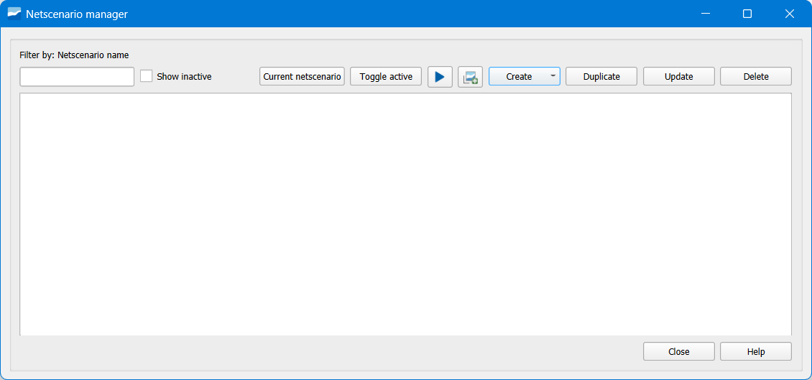

   Ventana del Gestor de Netscenarios de Giswater.

En la creación de los *netscenarios* se nos solicitarán cosas básicas como el **nombre** a dar, 
una leve **descripción**, el **tipo** (que puede ser DMA o PRESSZONE), si deseamos que esté **activo** o 
no y la explotación a la que lo queremos asignar.

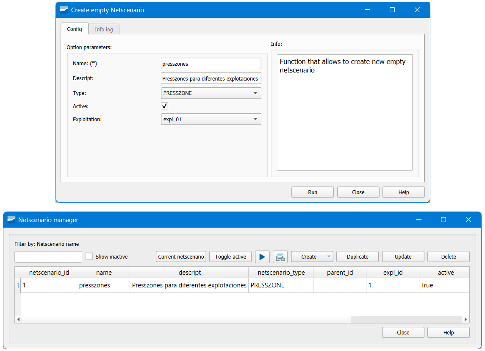

   Creación de un empty netscenario de ejemplo.

**Gestión de escenarios**

Es importante mencionar que podemos tener **distintas zonas del mapa** dentro de nuestro *Gestor de Netscenarios* y, 
para administrarlas de una mejor manera, tenemos algunas opciones:

- **Show inactive:** muestra las zonas del mapa que están definidas con active False.
- **Current netscenario:** es el netscenario que se tiene activo en ese momento y el que **simularía.**Se muestra justo a la izquierda, en este caso presszones.
- **Toggle active:** al seleccionar un netscenario y pinchar sobre este botón, lo hace activo.
- **Execute mapzones analysis:** es el disparador de las zonas del mapa .. |icon_play| .
- **Cargar capas Giswater:** nos permite cargar capas asociadas al netscenario.

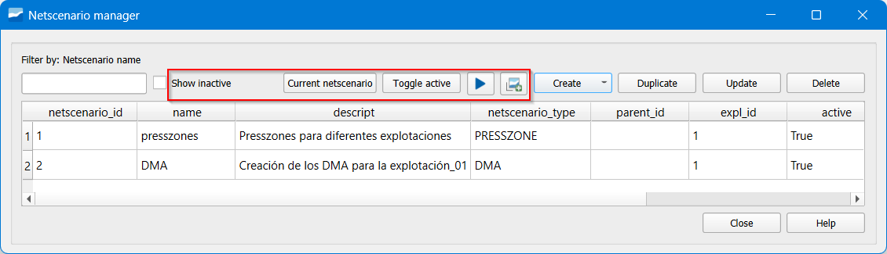

   Creación de escenarios.

Escenario de red - Mapzone
==========================

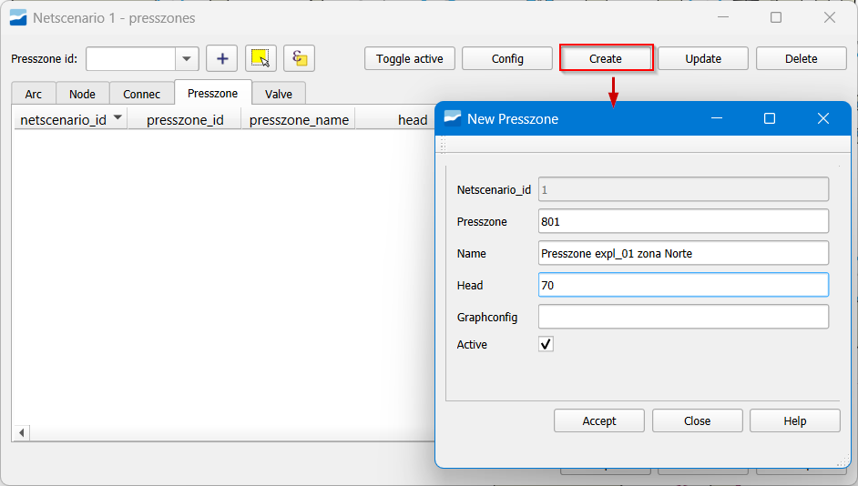

   Creación de un mapzone.

**Configuración del graph**

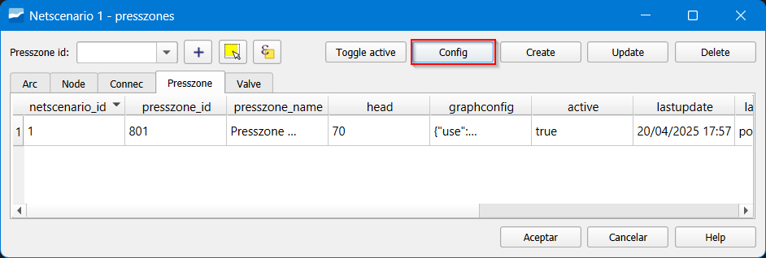

   Botón *Config* dentro del escenario.

- nodeParent: es el *header* de la zona. Con el selector, se elige el punto directamente 
desde el inventario. Puede ser uno o varios nodos.
- toArc: dirección del flujo en el header.
- ignore:
- forceClosed: esta funcionalidad es de suma importancia ya que, como se mencionó, las válvulas 
cerradas son los verdaderos *stoppers* pero, cuando no tenemos, podemos definir cualquier nodo que esté 
sobre la red como *stopper* forzándolo a que se cierre.

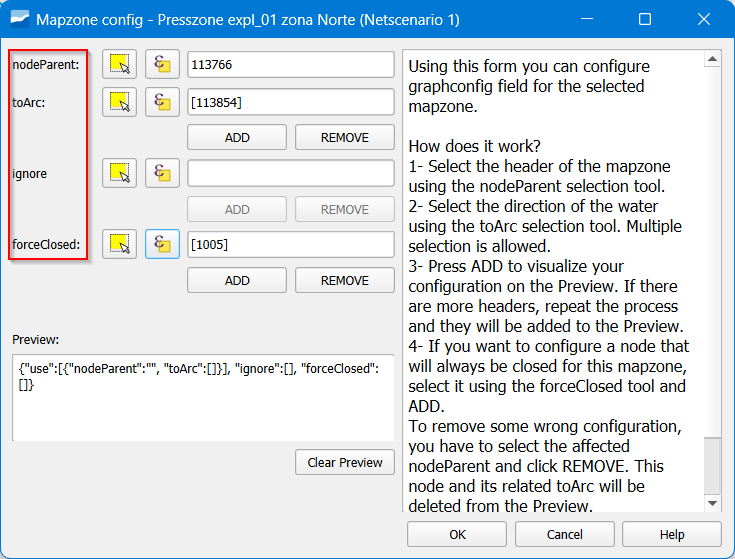

   Opciones a configurar del *graphconfig*.

**Update de un mapzone**

Otro de los botones importantes a utilizar es *Update*. 
Este último es importante ya que si queremos **agregar** o **quitar** *headers* o 
nodos en *force closed* lo debemos hacer desde aquí.

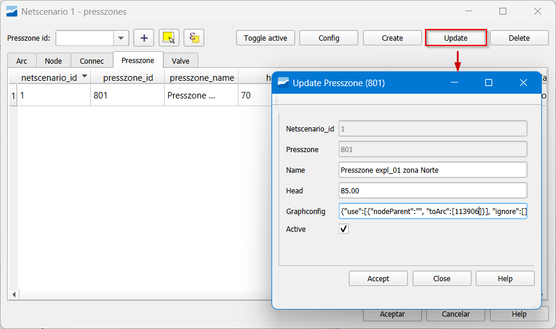

   Ventana *Update*.

**Cerrado de válvulas en netscenario**

Hemos visto que con el *forceClosed* en la configuración del grafo (de forma permanente) o 
con el *Force Closed Nodes* en diálogo de ejecución de algoritmo (de forma efímera) se puede forzar 
el paro del algoritmo. Sin modificar inventario, existe una tercera opción: hacerlo en el escenario 
trabajando en capa de válvulas.

1. Cargar capa netscenario valve en ToC

.. figure:: img/img_escenarios/capa_netscenario_valve.png

   Agregar la capa desde el botón *Cargar capas Giswater*.

2. Click botón derecho *Info de Giswater*.

Esto hace que nuestro inventario permanezca más ordenado y el escenario quede más completo, 
tanto con las zonas del mapa, como con las válvulas que se definirían como cerradas en un futuro 
inventario de la red.

**Ejecución del algoritmo**

Una vez configuradas las zonas, se procede a su ejecución. Esto lo hacemos desde el 
*Netscenario manager* donde hay ciertas opciones que debemos saber definir bien:

- **Create mapzones for netscenario:** se completa de manera automática según el 
*nescenario* que esté seleccionado como *current*.
- **Flood only one mapzone:** en caso de sólo querer simular una de las *presszones* 
seleccionadas, insertamos su id.
- **Force open nodes:** en caso de querer forzar abrir un elemento para que no funcione como *stopper*.
- **Force closed nodes:** se pueden cerrar nodos para que actúen como *stoppers*, igual que se hace desde la configuración.
- **Use selected psectors:** no hay que activarla.
- **Mapzone constructor method:** la manera en la que queremos que se construya nuestra *mapzone*.
- **Pipe buffer:** el tamaño del *buffer* alrededor de la tubería que queremos.

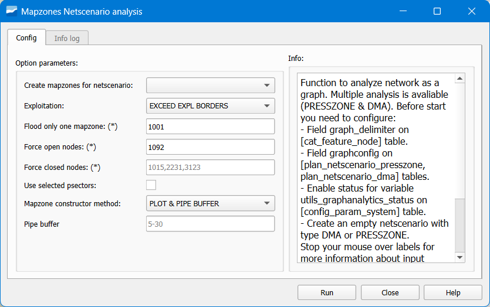

   Herramienta de Giswater *Mapzones Netscenario analysis*.

**Mapzone construct method**

- **None**: No genera ninguna geometría.
- **Concave Polygon**: Genera un polígono con forma cóncava.
- **Pipe Buffer**: Realiza un buffer alrededor de la tubería, del tamaño seleccionado en las 
opciones de simulación.
- **Plot & Pipe Buffer**: Además de realizar un buffer alrededor de la tubería, pinta las capas de edificios 
que estén cargadas en el proyecto.
- **Link & Pipe Buffer**: Además de pintar el buffer alrededor de las tuberías, pinta todos los links del proyecto.

**Objetos de estudio**

Si lo que andamos buscando es tener zonas de presión que **cumplan con ciertas** características 
como, por ejemplo, un rango de presiones, se puede empezar un proceso iterativo con el *Head* de la 
creación de las *presszone*. Esto va a permitir ir variando la presión en la zona deseada hasta obtener el valor buscado.

Además es importante mencionar que, al igual que los *dscenarios*, los **netscenarios** cuentan 
con capas Giswater que pueden servir para el análisis deseado. Capas como *Netscenario 
Presszone* que nos muestra las zonas ejecutadas, *Netscenario conne*c o *Netscenario valve*, 
nos permiten realizar mapas temáticos con **elementos de red dentro del escenario**, que han 
intervenido para obtener los resultados deseados.

También es importante mencionar que estos elementos de las capas se pueden visualizar 
desde la selección de nuestra zona, los atributos y cantidad de estos elementos, 
envueltos en nuestro escenario de zona del mapa.

Escenario de red - Presszones
=============================

Para determinar las presiones y optimizarlas según sea la necesidad de la red, utilizaremos 
las *presszones.*
Estas son zonas del mapa que tienen como cabecera un depósito o las válvulas de control 
hidráulico (en el caso teórico), y **mediante la diferencia entre la carga y la elevación 
de los nodos**, determina la presión estática a lo largo de la red.

Por ejemplo, si se nos solicita que ciertas zonas del mapa tengan máximos y mínimos de 
presión por necesidades hidráulicas o para reducir las pérdidas como se mencionó anteriormente, 
es posible mediante una definición e iteración de las *presszones* hasta obtener la presión deseada.

.. attention::
   
   Al ser un algoritmo topológico, las *presszones* solamente determinan la presión estática mediante 
   diferencia de cargas y elevaciones, **no tiene en cuenta aspectos como rugosidad de las tuberías o 
   pérdidas locales por elementos de la red.**

Para poder gestionar de forma más eficiente las presiones, podemos generar 
un escenario de PRESSZONES (zonas de operación).

Para trabajar las *presszones* desde los *netscenarios*, lo primero que se tiene que 
hacer es crear uno de la misma forma con los Mapzones.
Al dar doble clic sobre nuestro netscenario tendremos la opción de hacerla activa 
(*Toggle active*), **configurar, crear, actualizar** o **eliminar**.

En la creación de las presszones dentro del escenario debemos definir:

- **Netscenario_id:** un número consecutivo que se asigna automáticamente.
- **Presszone_id:** el identificador numérico de la DMA.
- **Name:** el nombre que le queremos dar a nuestra DMA.
- **Head:** Valor de la carga de salida del header.
- **Graphconfig:** se completará más adelante al configurar la zona.
- **Active:** si queremos activarla o no.

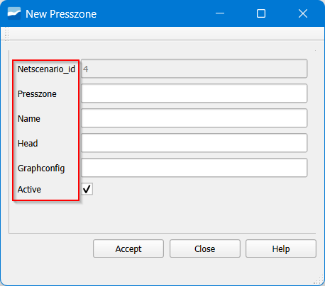

   Opciones en la creación de las presszones.

**Configuración del graph**

En temas de configuración, estas zonas funcionan de la misma manera que las Mapzone
tenemos que definir el *nodeParent* (que en este caso es la cabecera) y los *forceClosed* 
(que serán los *stoppers* definidos según los intereses de quien modela la red).

**Ejecución del algoritmo**

Para la ejecución del algoritmo para PRESSZONES: desde el botón *Execute mapzones análisis* |icon_execute_mapzones| 
el cual nos desplegará las mismas opciones que se han mencionado anteriormente.

Sectorización hidrométrica
==========================

El proceso de sectorización por DMA implica dividir la red en áreas más pequeñas y gestionables. 
Detallamos algunos de los pasos típicos involucrados en este proceso:

1. Definición de DMAs: selección de límites, basándose en el análisis hidráulico y los datos de consumo, 
establecer límites para las DMAs que dividan la red en áreas más pequeñas y coherentes en términos de 
flujo de agua y demanda. Estas nuevas zonas siempre deberán tener al menos un caudalímetro por el cual les entre agua.

2. Instalación de infraestructura: instalación de válvulas y caudalímetros sectoriales, 
en los puntos estratégicos de la red definidos en el apartado anterior.

3. Implementación y monitoreo: pruebas y ajustes, que consistirán en realizar pruebas operativas 
para asegurar que las DMAs estén correctamente definidas y que la infraestructura funcione 
según lo previsto. Realizar ajustes según sea necesario.

4. Mantenimiento: realizar mantenimiento preventivo de la infraestructura de las DMAs, incluyendo 
la limpieza y calibración de válvulas y medidores.

Para poder obtener la cantidad de agua que entra y sale de una zona determinada, en Giswater utilizamos las DMA (zonas de medición).
Son zonas que poseen como *header* teórico uno o varios **caudalímetros** y como *stoppers* **válvulas cerradas** 
o elementos que definamos como *Force closed*.
Este proceso será iterativo y, al igual que con las *presszones*, para las DMA podemos trabajar con escenarios desde el *Netscenario.*

Dentro de las creaciones de las DMA, en el escenario debemos definir:
- **Netscenario_id:** un número consecutivo que se asigna automáticamente.
- **Dma_id:** el identificador numérico de la DMA.
- **Name:** el nombre que le queremos dar a nuestra DMA.
- **Pattern_id:** opción para asignar un pattern de demanda, aunque no es necesario.
- **Graphconfig:** se completará más adelante al configurar la zona.
- **Active:** si queremos activarla o no.

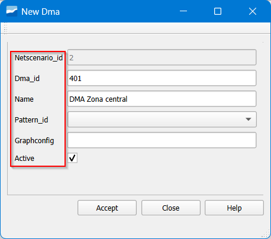

   Opciones en la creación de las DMA.

En temas de **configuración**, estas zonas funcionan de la **misma manera que las presszones.** 
Tenemos que definir el *nodeParent* (que en este caso es la cabecera) y los *forceClosed* 
(que serán los *stoppers* definidos según los intereses de quien modela la red).

Para la ejecución de las DMA se hace igual que para las presszones: desde el botón *Execute mapzones analisis* 
el cual nos desplegará las mismas opciones que se han mencionado anteriormente.

Zonas de intermitencias del servicio
====================================

Como se ha venido comentando, si bien las cabeceras y los *stoppers* están bien definidos de manera teórica para 
cada una de las mapzones, **Giswater tiene flexibilidad en este aspecto.**

Por lo que, a pesar de que se espera contar en un futuro con la incorporación del IWSA (*Intermitent Water Supply 
Areas*) de momento, podemos utilizar las mismas DMA para definir zonas importantes como lo son las **Zonas de 
Rotación.**

Estas son zonas que han sido identificadas con escasez severa de agua y se le realizarán racionamientos 
eventualmente. Es así, como definiendo las cabeceras como válvulas de corte, podemos simular áreas en las 
cuales se realizarán racionamientos del servicio. Su *header* es una válvula de corte ya que será la que se 
deberá manipular para regular el flujo.
Este es sólo un ejemplo de las muchas aplicaciones que pueden tener estas áreas y lo útiles que son en la 
operación y mantenimiento de las redes de abastecimiento.

**Verificación con modelo hidráulico**

Una vez realizadas las tareas de diseño como cumplir con rangos de presión o generar DMA con 
características específicas, podemos simular nuestras redes y realizar análisis cruzados entre lo que hemos 
diseñado y los resultados de la modelación.

Comparaciones entre presiones estáticas y presiones dinámicas podrían permitir analizar y entender la red desde 
otras perspectivas.

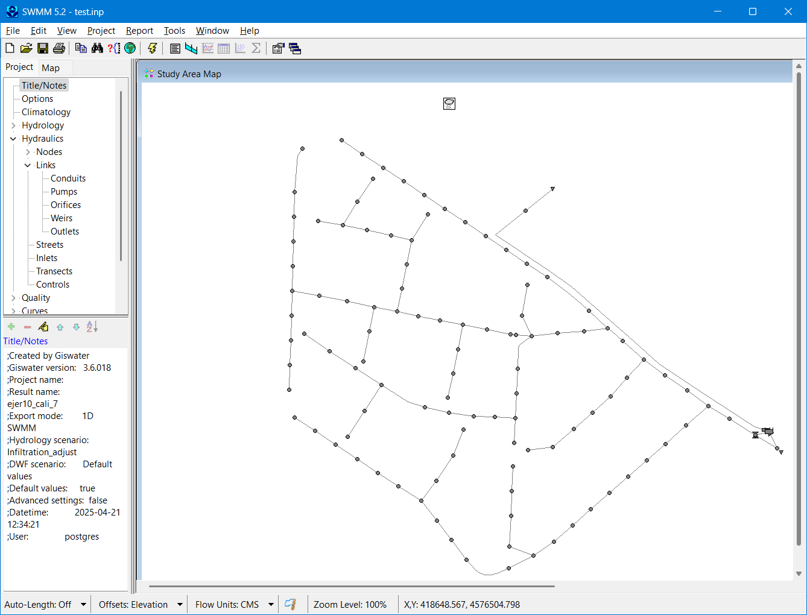

   Simulación con SWWM.

 

