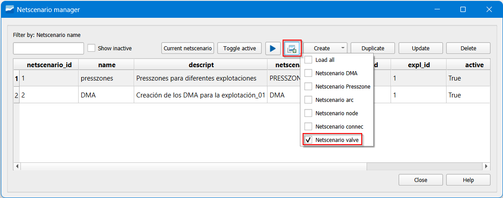

===============================
Red scenarios (netscenario)
===============================

Giswater allows performing different **changes in the map zones and with this it is possible to optimize them.**
For example, if the results obtained in the DMA are not as expected,
**it is possible to propose more zones and reduce and detect losses each time with more precision.**

If, in addition to this, we have detected zones with very high physical losses,
**we can regulate the pressure in the same ones** and reduce water waste, according to the needs of the network.
To do this, we can use the *Presszone,* in the same way, modify them through scenarios, and with this determine
what static pressures we will have in different points, without the need to make changes in the inventory.

.. note::
   The more leaks we have in our system and the higher the pressure,
   the more water losses we will have in the network.

To be able to perform **different scenarios of the** ***mapzones,*** we will use the *Netscenarios* tool.
It is a functionality similar to the dscenarios but, in this case, they are scenarios of
map zones. That is, it allows us to define *headers* and *stoppers* different from those existing in the inventory and with this, to have different proposals of
zoning without altering the inventory.

.. attention::
   
   As with the dscenarios, for the case of the netscenarios **it is not strictly necessary to use them** nor is the only
   way to achieve the desired objectives, but **it is the most recommended way to do it,** because it allows us to maintain a difference between the inventory values and the modified ones to make
   tests or create a scenario within the same network.
 
Some of its advantages are mentioned below:

- As they are scenarios, it allows iterating as many times as necessary and makes it easy to modify the zones.

- The current zoning is not modified, that is, the changes are generated in parallel to what is found in the inventory.

- In addition to the temporal layers, we can load layers like the *netscenario_ arc, netsceario_connec* or *netscenario_valve* 
that allow us to see changes in these elements according to the zoning.

- It facilitates the generation of thematic maps with different proposals of zoning and elements 
involved in the same such as connecs, valves or pipes.

The *Netscenarios* are created and managed from the *Netscenario manager* |icon_ns| . 

Through this button we can **create** new scenarios, **duplicate, update** and/or **delete.**

.. figure:: img/img_escenarios/netscenario_manager.png

   Window of the Netscenario manager of Giswater.

In the creation of the *netscenarios* we will be asked for basic things like the **name** to give, 
a slight **description**, the **type** (which can be DMA or PRESSZONE), if we want it to be **active** or 
not and the exploitation to which we want to assign it.

.. figure:: img/img_escenarios/netscenario_creado.png

   Creation of an empty netscenario example.

**Scenario management**

It is important to mention that we can have **different map zones** within our *Netscenario manager* and, 
to manage them in a better way, we have some options:

- **Show inactive:** shows the map zones that are defined with active False.
- **Current netscenario:** is the netscenario that is active at that moment and the one that **simulates.**It is shown just to the left, in this case presszones.
- **Toggle active:** when selecting a netscenario and clicking on this button, it makes it active.
- **Execute mapzones analysis:** is the trigger of the map zones .. |icon_play| .
- **Load Giswater layers:** allows loading layers associated with the netscenario.

.. figure:: img/img_escenarios/gestion_netscenario.png

   Creation of scenarios.

Netscenario - Mapzone
==========================

.. figure:: img/img_escenarios/presszones.png

   Creation of a mapzone.

**Graph configuration**

   *Config* button within the scenario.

- nodeParent: is the *header* of the zone. With the selector, we choose the point directly
from the inventory. It can be one or several nodes.
- toArc: direction of the flow in the header.
- ignore:
- forceClosed: this functionality is of great importance because, as mentioned, the closed valves are the true *stoppers* but, when we don't have them, we can define any node that is
on the network as a *stopper* forcing it to close.

.. figure:: img/img_escenarios/config_parameters.png

   Options to configure the *graphconfig*.

**Update of a mapzone**

Another important button to use is *Update*.
This last one is important because if we want to **add** or **remove** *headers* or
nodes in *force closed* we must do it from here.

   *Update* window.

**Closing valves in netscenario**

We have seen that with the *forceClosed* in the graph configuration (permanently) or
with the *Force Closed Nodes* in the algorithm execution dialog (temporarily) we can force
the stop of the algorithm. Without modifying the inventory, there is a third option: doing it in the scenario
working on the valves layer.

1. Load netscenario valve layer in ToC

   Add the layer from the *Load Giswater layers* button.

2. Click right *Info Giswater*.

This makes our inventory remain more ordered and the scenario more complete,
both with the map zones, as with the valves that would be defined as closed in the future
inventory of the network.

**Execution of the algorithm**

Once the zones are configured, we proceed to their execution. We do this from the
*Netscenario manager* where there are certain options that we must know to define well:

- **Create mapzones for netscenario:** it is completed automatically according to the
*nescenario* that is selected as *current*.
- **Flood only one mapzone:** if we only want to simulate one of the selected *presszones*, we insert its id.
- **Force open nodes:** if we want to force open an element so that it does not work as a *stopper*.
- **Force closed nodes:** we can close nodes so that they act as *stoppers*, just as we do from the configuration.
- **Use selected psectors:** not to activate.
- **Mapzone constructor method:** the way we want our *mapzone* to be built.
- **Pipe buffer:** the size of the *buffer* around the pipe we want.

.. figure:: img/img_escenarios/algoritmo.png

   Giswater *Mapzones Netscenario analysis* tool.

**Mapzone construct method**

- **None**: Does not generate any geometry.
- **Concave Polygon**: Generates a concave polygon.
- **Pipe Buffer**: Performs a buffer around the pipe, of the size selected in the simulation options.
- **Plot & Pipe Buffer**: In addition to performing a buffer around the pipe, paints the buildings layers
that are loaded in the project.
- **Link & Pipe Buffer**: In addition to painting the buffer around the pipes, paints all the links of the project.

**Study objects**

If what we are looking for is to have pressure zones that **meet certain** characteristics
like, for example, a pressure range, we can start an iterative process with the *Head* of the
creation of the *presszone*. This will allow us to vary the pressure in the desired zone until we obtain the desired value.

It is also important to mention that, like the *dscenarios*, the **netscenarios** have Giswater layers that can serve for the desired analysis. Layers like *Netscenario
Presszone* that shows the executed zones, *Netscenario conne*c or *Netscenario valve*,
allow us to create thematic maps with **red elements within the scenario**, that have
intervened to obtain the desired results.

It is also important to mention that these elements of the layers can be visualized
from the selection of our zone, the attributes and the amount of these elements,
enveloped in our scenario of map zone.

Netscenario - Presszones
=============================

To determine the pressures and optimize them according to the needs of the network, we will use
the *presszones.*
These are map zones that have a header as a reservoir or hydraulic control valves (in the theoretical case), and **through the difference between the load and the elevation
of the nodes**, determines the static pressure along the network.

For example, if we are asked that certain map zones have maximum and minimum pressures for hydraulic needs or to reduce losses as mentioned above,
it is possible through a definition and iteration of the *presszones* until we obtain the desired pressure.

.. attention::
   
   As it is a topological algorithm, the *presszones* only determine the static pressure through
   difference of loads and elevations, **does not take into account aspects such as pipe roughness or
   local losses by network elements.**

To manage pressures more efficiently, we can generate a PRESSZONES (operation zones) scenario.

To work with the *presszones* from the *netscenarios*, the first thing that has to be done is to create one in the same way with the Mapzones.
By double clicking on our netscenario we will have the option to make it active 
(*Toggle active*), **configure, create, update** or **delete**.

When creating the presszones within the scenario we must define:

- **Netscenario_id:** a consecutive number that is assigned automatically.
- **Presszone_id:** the numerical identifier of the DMA.
- **Name:** the name we want to give to our DMA.
- **Head:** Value of the load output of the header.
- **Graphconfig:** it will be completed later when configuring the zone.
- **Active:** if we want to activate it or not.

.. figure:: img/img_escenarios/create_presszone.png

   Options in the creation of the presszones.

**Graph configuration**

In terms of configuration, these zones work in the same way as the Mapzone
we have to define the *nodeParent* (which in this case is the header) and the *forceClosed*
(which will be the *stoppers* defined according to the interests of the one who models the network).

**Execution of the algorithm**

For the execution of the algorithm for PRESSZONES: from the *Execute mapzones analysis* button |icon_execute_mapzones|
which will show the same options as mentioned above.

Hydrometric sectorization
==========================

The hydrometric sectorization process involves dividing the network into smaller and manageable areas.
We detail some of the typical steps involved in this process:

1. Definition of DMAs: selection of limits, based on hydraulic analysis and consumption data,
set limits for the DMAs that divide the network into smaller and more coherent areas in terms of
water flow and demand. These new zones must always have at least one flow meter through which they enter water.

2. Installation of infrastructure: installation of sectorial valves and flow meters,
in the strategic points of the network defined in the previous section.

3. Implementation and monitoring: tests and adjustments, which will consist of performing operational tests
to ensure that the DMAs are correctly defined and that the infrastructure works as expected. Make adjustments as necessary.

4. Maintenance: perform preventive maintenance of the infrastructure of the DMAs, including
cleaning and calibration of valves and meters.

To obtain the amount of water that enters and leaves a determined area, in Giswater we use the DMA (measurement zones).
They are zones that have a theoretical *header* with one or several **flow meters** and *stoppers* **closed valves**
or elements that we define as *Force closed*.
This process will be iterative and, just as with the *presszones*, we can work with scenarios from the *Netscenario.*

Within the creation of the DMAs, in the scenario we must define:
- **Netscenario_id:** a consecutive number that is assigned automatically.
- **Dma_id:** the numerical identifier of the DMA.
- **Name:** the name we want to give to our DMA.
- **Pattern_id:** option to assign a demand pattern, although not necessary.
- **Graphconfig:** it will be completed later when configuring the zone.
- **Active:** if we want to activate it or not.

.. figure:: img/img_escenarios/opcitions_new_dma.png

   Options in the creation of the DMAs.

In terms of **configuration**, these zones work in the **same way as the presszones.**
We have to define the *nodeParent* (which in this case is the header) and the *forceClosed*
(which will be the *stoppers* defined according to the interests of the one who models the network).

For the execution of the DMAs it is the same as for the presszones: from the *Execute mapzones analysis* button
which will show the same options as mentioned above.

Intermittent service areas
====================================

As it has been commented, although the headers and *stoppers* are well defined theoretically for
each of the mapzones, **Giswater has flexibility in this aspect.**

Although we expect to count with the incorporation of the IWSA (*Intermitent Water Supply Areas*) in the future, we can use the same DMAs to define important areas like the **Intermittent Water Supply Areas.**

These are areas that have been identified with severe water shortage and will eventually be rationed.
As such, by defining the headers as cut valves, we can simulate areas in which rationing will be carried out. Its *header* is a cut valve because it will be the one that should be manipulated to regulate the flow.
This is only an example of the many applications that these areas can have and how useful they are in the operation and maintenance of water supply networks.

**Verification with hydraulic model**

Once the design tasks have been carried out, such as meeting pressure ranges or generating DMAs with specific characteristics, we can simulate our networks and perform cross-analyses between what we have designed and the results of the modeling.

Comparisons between static and dynamic pressures could allow analyzing and understanding the network from other perspectives.

.. figure:: img/img_escenarios/model.png

   Simulation with SWMM.

 

