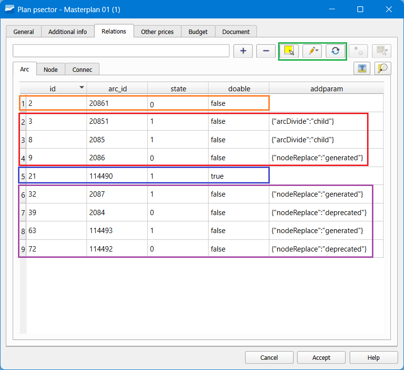

.. _planning-sectors:

==============================
Planning sectors
==============================
*This chapter aims to answer some of the most advanced or complex questions about the use of planning sectors 
(in the future psectors or alternatives).*

.. attention:: Before reading this section it is important to have the knowledge that is transmitted in the sections-planning-sectors-psectors and masterplan, where the operation of the psector is introduced. It is also important to know the topological rules of the planned elements, explained in the section-topological-rules, especially the topology of states and the behavior of links in planning.

It is important to highlight some characteristics, describe processes that have not yet been mentioned or exemplify use cases.

Manage the relationships between red elements and psectors
=================================================================
The complexity of the psector starts in the Relations tab, where the elements that will form part of this alternative are established, either to introduce new trace of red or to remove part of this.

Characteristics for each type of element:

.. _Arc:

Arc
-----
Arcs can be introduced related in the following way:

* **Add a new arc in the Planned state** using the usual drawing tools. This could use service or planned nodes to connect. State=1, Doable=True (blue in the Image).

* Select an existing arc using the **Select elements** button (1st icon in green in the Image) inside the Relations tab (sub tab Arc). This will disappear from the map when the alternative is active. *State=0, Doable=False* (orange in the Image).

* Use the **Replace arc in service by planned** button (3rd icon in green in the Image) when we only want to change the catalog (material and diameter) of an existing arc but keep exactly the same trace. Two records will enter the Relations tab: *State=1, Doable=True* (for the new) and State=0, Doable=False (for the old)

* **Divide a planned node with a service arc.** This triggers an automatic process where two new arcs are generated and the one in service is 'deactivated'. The new arcs will be called 'fictitious' or 'to maintain', since they keep the previous catalog and trace and are only necessary to maintain the topology. *State=1, Doable=False* (for the new) and *State=0, Doable=False* (for the old) (red in the Image).

* **Put a planned node on top of a service node.** This also triggers an automatic process and generates 'fictitious' arcs for all that intersect with this replaced node. The arcs in service are 'deactivated'. It is used to maintain the topology. *State=1, Doable=False* (for the new) and *State=0, Doable=False* (for the old) (purple in the Image).

.. note::The arcs that appear in the Relations tab from an automatic process can be easily identified through the addparam column, which informs if it is a process of arc division ('parents' or 'children') or node replacement ('generated' or 'deactivated').

*Image: Several examples of records in the Arc tab of the relations of a psector.*

**Arcos ficticios**

These are generated automatically through the processes explained of arc division or node replacement. 
They can be identified because a **state_type** different from the usual for planned elements is established. 
In the sample schema of Giswater this is FICTICIUS, but it can be configured and changed its name or add a new one through:

1. Modify the **value_state_type** table, changing names or adding records with state=2.

2. In the **config_param_system** table modify the value of the variable **plan_statetype_vdefault** in the *key plan_statetype_ficticius.*

Although they are generated automatically, once generated they can be modified again to adapt their use to what we really 
we want to make in the psector. Examples:

* If we want to make a **substitution of only part of an arc**, we must cut it with a node at the point where we want to end the substitution. Of the two fictitious arcs generated, to one of them we can change the catalog and the state_type to identify that it is no longer fictitious (so it can be symbolized in a different way). If we want it to enter the budget of the psector, we must change the *doable* field to True.

* If we want to **cut an existing arc in half and remove the other part**, we must do the same as before but this time simply we will remove one of these fictitious arcs. We can delete with the plugin tool or with the QGIS tool itself.

.. _Node:

Node
-----
Nodes can be introduced related in the following ways:

* **Add a new node in the Planned state** using the usual drawing tools. This will only be able to exercise as an initial or final node for arcs in the Planned state. *State=1*, *Doable=True* (blue in the Image).

* Select an existing node using the **Select elements** button (1st icon in green in the Image) inside the Relations tab (sub tab Node). This will disappear from the map when the alternative is active. *State=0, Doable=False* (red in the Image).

* Use the **Merge with planned arcs** button (4th icon in green in the Image) when we want to make a node in service disappear and join in one only the two arcs that connect to it. A record enters the Relations tab: *State=0, Doable=False* (orange in the Image) and also 3 records appear in the Arc tab: State=1, Doable=True (for the new) and State=0, Doable=False (for the old).

As seen in the section :ref:`Arc`, when placing Planned nodes on arcs various processes of arc division will occur with the results mentioned.

.. figure:: img/planning-sectors/node.png

*Image: Several examples of records in the Node tab of the relations of a psector.*

.. _Connec_Gully_Links:

Connec, Gully y Links
-------------------------
Connec or gullys (in the future connections) can be introduced related in several ways. In this case it is also important to 
make special emphasis on the management that can be made of the **links** that join the connections with the red. It can be managed 
in the following ways:

* **Add a new connection in the Planned state** using the usual drawing tools. *State=1, Doable=True* (blue in the Image). It can be connected to the red through links in the ways described in the section :ref:`Comportamiento_link`

* Select an existing connection using the **Select elements** button (1st icon in green in the Image) inside the Relations tab. In this case, initially it will enter the relations as *State=1, Doable=False* (red in the Image). Next it can be modified the **link** changing the **arc_id** (5th icon in green in the Image). If we want to give it up in this alternative, we must change the *State=0* (orange in the Image).

* With the substitution of any arc that has connections using the methods described in the sections :ref:`Arc` and :ref:`Node`. All affected connections will enter the relations with *State=1, Doable=False*. It can be modified later if we want to give up or change link.

.. figure:: img/planning-sectors/connec.png

*Image: Several examples of records in the Connec tab of the relations of a psector.*

Herramienta para cambiar estado y doable
-------------------------------------------
As has been commented in the previous sections, the most important fields in the relations tables with psector are **State** and **Doable**. 
These can be modified according to the needs of the user. For example, in the case of connections, it is common to have to pass 
from State=1 to State=0 when we want to give up an existing connection.

In the Relations tab of the form there is a specific button (Image) to be able to make changes in these columns easily and multiple. 

On the elements selected in the table, you can click the button and choose if you want to change the *state* or the *doable*. 
In either case, the program will change the value by passing from 1 to 0 or vice versa and from true to false or vice versa.

.. figure:: img/planning-sectors/state_doable.png

*Image: Button to change State or Doable of the elements in psector.*

Advanced use of links in the Planned state
------------------------------------------------
There are several ways to manage the connections and their links when they are in the Planned state. 

**For each connection with State=1 in the psector a new link will be created in the database**. There are two possible scenarios:

* Connection in the **Planned state** - It will have 1 link in the Planned state.

* Connection in the **In Service state** - It will have 2 links, 1 in the In Service state (that will be visualized without the psector), 1 in the Planned state (that will be visualized with the psector). 

This second case is used to change the way of connection using the psector. To do it we have to:

1. Add the desired connections to the **Relations** of the psector using the methods explained in :ref:`Connec_Gully_Links`.

2. Change the **geometry** of the link or its **arc_id**. It can be done in several ways:

 a. **Edit the link manually** with the usual QGIS tools. In case the connection point is on a different arc, the arc_id will be automatically changed.

 b. Use the **Set arc_id** tool in the Connections tab of the psector. On the selected rows you can set to which arc you want to connect. You can set the connection point to the closest point of the selected arc *(Set closest point)* or the exact point where the click was made on the arc *(Set user click)*.

 .. figure:: img/planning-sectors/set_arc_id.png

*Image: Button to set a new arc_id in the connections in psector.*

Ejecutar un psector
------------------------------
One of the fields to consider in the psector is its **State**, since depending on the value set certain changes can be executed automatically.

When a psector is executed or cancelled, its **related elements will be transferred to traceability tables**, 
where the information will be clear and easy to consult. The Psector Manager will continue having the alphanumeric information 
and the polygon geometry around the elements, but the relations with the inventory elements will disappear.

The traceability tables are:

* audit_psector_arc_traceability

* audit_psector_node_traceability

* audit_psector_connec_traceability

* audit_psector_gully_traceability

These tables will contain all the information stored in the plan_psector_x_* tables plus the executed action 
(EXECUTE or CANCEL) plus all the information in the inventory tables (arc, node, connec, gully).

There are 5 different psector state types, with their related actions:

* **PLANNED**- No action

* **IN PROGRESS** - No action

* **EXECUTED (Save traceability)** - The related elements will be inserted in the traceability tables with the action Psector Executed. 

* **EXECUTED (Set OPERATIVE and Save traceability)** - The elements that were planned will be converted to OPERATIVE state. The elements planned to be deleted will be converted to OBSOLETE state. To also maintain the traceability, the related elements will be inserted in the traceability tables with the action Psector Executed. 

* **CANCELLED (Save traceability)** - The related elements will be inserted in the traceability tables with the action Psector Cancelled. 

.. figure:: img/planning-sectors/states-display.png

*Image: Form of a psector where the available states are shown.*

The traceability tables **are ready to load** into the QGIS project using the Load Giswater layers button. 
By default, a useful symbology will be established to **differentiate visually between planned, obsolete or affected elements.** 
Obviously then this symbology can be modified by the user and establish a more appropriate one based on your needs.

.. figure:: img/planning-sectors/traceability.png

*Traceability tables: example of a psector executed with a different symbology for planned or affected elements.*

