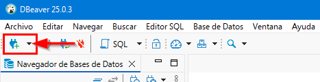
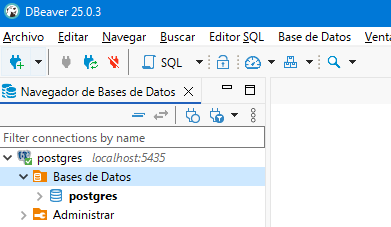
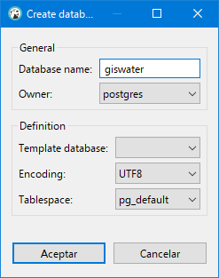
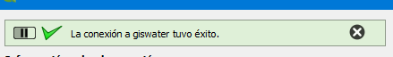

.. _previous-connections-creation:

========================================================
Creation of previous connections and the database
========================================================

.. only:: html

   .. contents::
      :local:

After installing the necessary programs, the following steps are to create the connection between DBeaver and PostgreSQL, create the working database
and create the connection between QGIS and the database.

Connection between DBeaver and PostgreSQL
===================================

Since we recommend using DBeaver as the database manager, to work we have to start by creating the connection between it and PostgreSQL.
For this, in DBeaver we will click on the corresponding button to create a new connection where we will select the *PostgreSQL* option.

    
     Creation of new PostgreSQL connection.

In the *Connect to database* window we have to fill in the following fields in the *General* tab to create the new connection:

- Host: if the data is stored on our local computer, we will put *localhost*; if not, we will put the IP address of the server where they are hosted.
- Port: number of the port to which we will connect.
- Database: name of the connection.
- User name: name of the user with which we will connect to the database.
- Password: password of the user with which we will connect to the database.
- Local Client: PostgreSQL client that we have installed. As we can have several PostgreSQL installed, we will have to select the one we want to work with.

.. figure:: img/previous-connections-creation/create-conection2.png

     Fields to fill in to create the connection between DBeaver and PostgreSQL.

It is advisable to mark the *Show all databases* checkbox so that we can visualize all the databases that we have available.
In the case of the *Save password* checkbox, **if we are working in a corporate environment, it is recommended not to mark for security reasons**.

.. warning::
   
     If we only have one version of PostgreSQL installed and we have not modified it during the installation, the connection port will be 5432.

Creation of the database
============================

With the connection created, the next step is to create the database that will store all the information of the networks.
For this, we will expand the created connection until we see the databases it contains.

     Visualization of the databases.

We can create a new database if we click with the right mouse button over *Databases* and select the *Create New Database* option.
In the popup window we will have to specify nothing more than the name we want to give to our database.

     Creation of new database.

Once created, we will see it listed along with all the others.

.. figure:: img/previous-connections-creation/all-databases.png

     Visualization of all databases.

Connection to the working database from QGIS
=================================================

With DBeaver and PostgreSQL linked, we will go to QGIS to be able to connect it with the recently created database.

For this, we will create a new connection to the database using the *Add PostGIS layers* button that is in the *Manage layers* toolbar, *Data source manager* or through the *Layer / Add layer* menu.

When we click on the *New* button a popup window will appear in which we will have to specify:

- Name: name we want to give to the connection in QGIS.
- Host: server where the data is located. If we are working locally, we will put *localhost*; if not, the IP of the server.
- Port: connection port to the database.
- Database: name of the database. 
- User name: name of our user in PostgreSQL.
- Password: password for our user in PostgreSQL.

.. figure:: img/previous-connections-creation/conection-qgis.png

     Creation of the connection to the database from QGIS.

Once the parameters are entered, we will click on the *Test connection* button. If everything is correct, in the top part of the window we will see the following message:

     Successfully connected to the database.

When we click on the *Accept* button we will have created the connection and it will be saved with the name indicated in the list of available connections.

When we are connected we can visualize the tables (with and without geometry) that contain the corresponding database and, if necessary, add it to the project.
