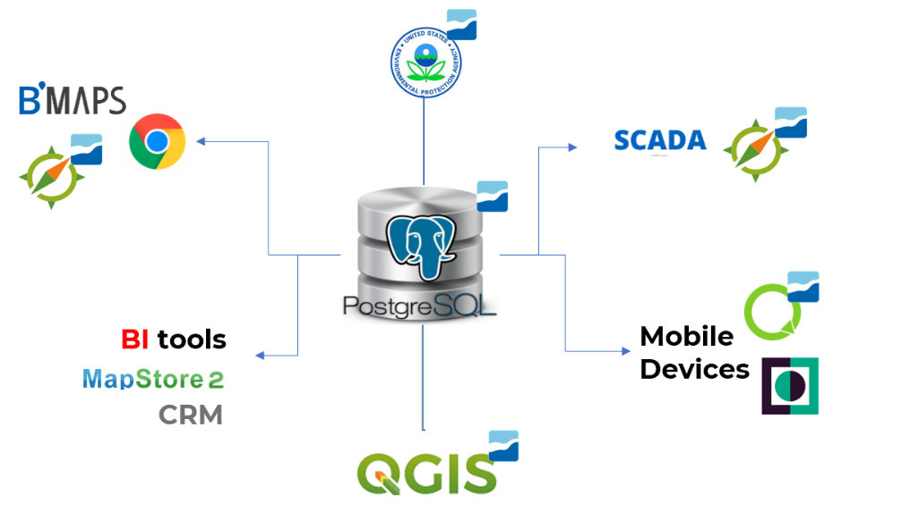

===============
¿Qué es Giswater?
===============

Giswater es una aplicación en formato libre pensada para la gestión y explotación
de los elementos de infraestructuras hidráulicas (abastecimiento y saneamiento), tanto en base de datos
como gráfica, a través de las que se tiene acceso desde cualquier sistema de información geográfica (GIS).

A su vez, Giswater también actúa como driver de conexión entre la base de datos espacial y 
herramientas de análisis hidráulico.

Como representa la Imagen 1, Giswater se enmarca dentro de una agrupación de aplicaciones que 
conjuntamente utilizadas permiten una gestión global y sólida en relación a los modelos de 
abastecimiento de aguas y drenaje urbano.

El elemento central del conjunto es la **base de datos**, donde se encuentra toda la información y 
gran parte de la funcionalidad de cada proyecto Giswater. La base de datos para usar Giswater es 
PostgreSQL, que junto con su extensión PostGIS permite enlazar cómodamente con el siguiente aplicativo 
del conjunto: QGIS.

    
    Esquema de aplicaciones que usa Giswater, centralizado en la base de datos.

Este software de sistemas de información geográfica es sobre el que se ha basado el desarrollo del 
proyecto Giswater, en su rama visual y de mayor operabilidad por parte del usuario. QGIS se relaciona 
mediante PostGIS con la base de datos, mostrando de forma organizada los datos espaciales y siempre 
teniendo en cuenta todas las reglas, relaciones y procesos que establece la base de datos.

El eje central del proyecto (Base de datos - GIS) también permite conectar con SCADA, para actualizar 
en tiempo real la información que proviene directamente de los elementos físicos de la red. 
De este modo Giswater se presenta como un sistema de gestión global y que da la posibilidad a sus 
usuarios de trabajar siempre con datos que se actualizan automáticamente.

Aparte de la gestión de los datos a través de un software GIS también existe la posibilidad de 
trabajar con los datos de Giswater en entorno web y móvil. Esta funcionalidad va aparte del uso 
habitual en desktop, pues es solo para clientes que lo requieran.

¿Cuál es el propósito de esta guía?
===================================

El propósito fundamental de esta guía es proporcionar al usuario un documento capaz de ayudar a 
realizar cualquier tarea con Giswater, desde la instalación inicial de los programas necesarios 
hasta las operaciones de gestión más complejas.

Las mejoras hechas en la versión 3 se verán reflejadas a lo largo del manual y se tratará de explicar 
de la mejor forma posible la finalidad de las mejoras y el uso que se debe hacer de ellas.

Además, en la Wiki de Github también se puede encontrar más información específica sobre el plugin, 
con un enfoque técnico más elevado: