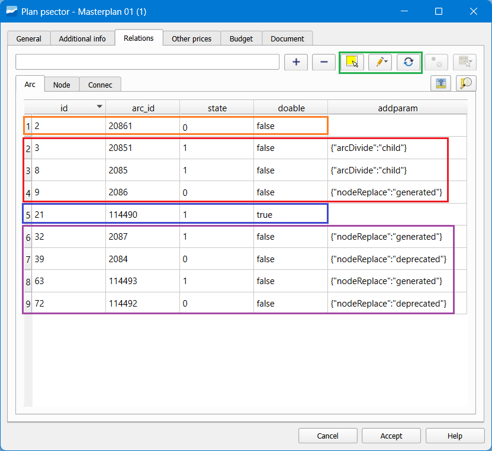
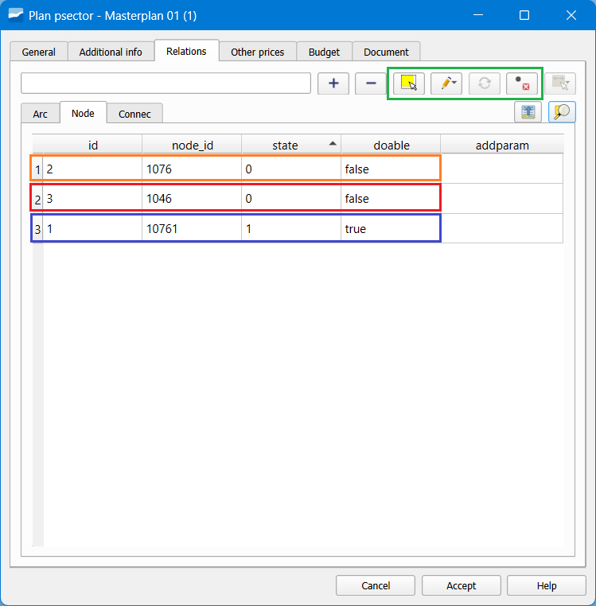
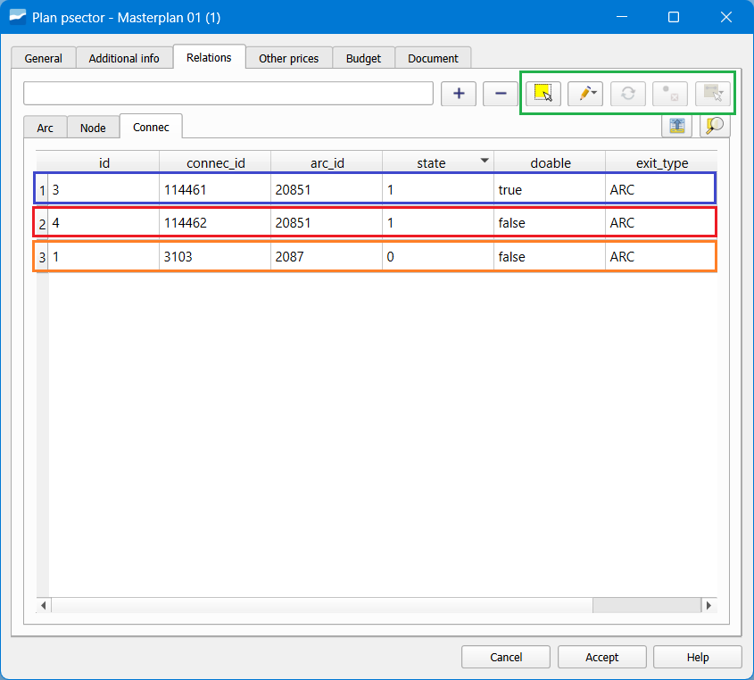
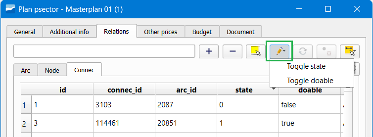
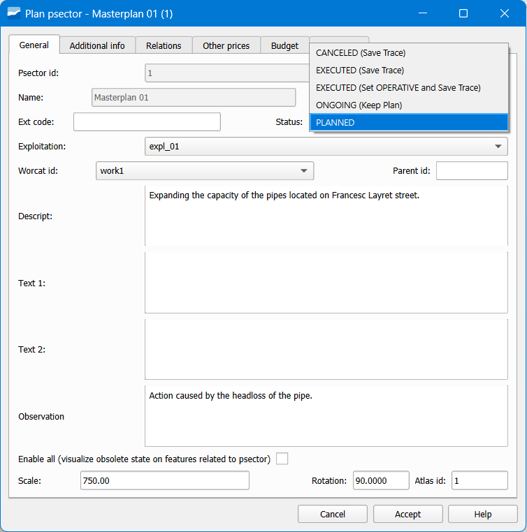
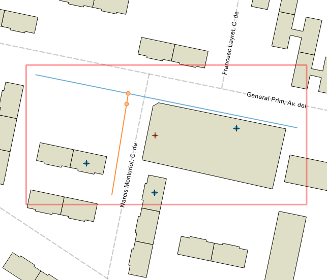

==============================
Sectores de planificación 
==============================
*Este capítulo pretender dar respuesta a algunas de las cuestiones más avanzadas o complejas del uso de sectores de planificación 
(en adelante psectors o alternativas).*

.. attention:: Antes de leer este apartado es importante contar con los conocimientos que se transmiten en los apartados-sectores-de-planificación-psectors y masterplan, dónde se introduce el funcionamiento de los psector. También es importante conocer las reglas topológicas de los elementos planificados, explicadas en el apartado-reglas-topologicas, especialmente la topología de estados y el comportamiento de los links en planificación.

Es importante destacar algunas características, describir procesos que aún no han sido mencionados o ejemplificar casos de uso.

Gestionar las relaciones entre elementos de la red y los psector
=================================================================
La complejidad de los psector empieza en la pestaña de Relaciones, dónde se establecen los elementos que formaran parte 
de esta alternativa, ya sea para introducir nuevo trazado de red o para quitar parte de este.

Características para cada tipo de elemento:

.. _Arc:

Arc
-----
Se pueden introduir arcos relacionados de las siguientes forma:

* **Añadir un nuevo tramo en estado Planificado** mediante las herramientas habituales de dibujo. Este podrá usar nodos en servicio o planificados para conectarse. State=1, Doable=True (color *azul* en la Imagen).

* Seleccionar un tramo existente mediante el botón de **Seleccionar elementos** (1r icono en color *verde^* en la Imagen) dentro de la pestaña Relaciones (sub pestaña Arc). Este desaparecerá del mapa cuando la alternativa esté activa. *State=0, Doable=False* (color *naranja* en la Imagen).

* Usar el botón de **Reemplazar arco en servico por planificado** (3r icono en color *verde* en la Imagen) cuando lo único que queremos es cambiar el catálogo (material y diámetro) de un arco existente pero mantener exactamente el mismo trazado. Entraran dos registros a la pestaña Relaciones: *State=1, Doable=True* (para el nuevo) y State=0, Doable=False (para el antiguo)

* **Dividir con un nodo Planificado un arco En Servicio.** Esto dispara un proceso automático dónde se generan dos tramos nuevos y se 'da de baja' el que había en servicio. Los tramos nuevos los llamaremos 'ficticios' o 'a mantener', ya que mantienen el catálogo y trazado anteriores y solo son necesarios para mantener la topología. *State=1, Doable=False* (para los nuevos) y *State=0, Doable=False* (para el antiguo) (color *rojo* en la Imagen).

* **Poner un nodo Planificado encima de un nodo En Servicio.** También dispara un proceso automático y se generan tramos 'ficticios' para todos los que intersecten con este nodo sustituido. Los tramos que había en servicio se 'dan de baja'. Sirve para mantener la topología. *State=1, Doable=False* (para los nuevos) y *State=0, Doable=False* (para los antiguos) (color *morado* en la Imagen).

.. note::Los tramos que aparecen en la pestaña de Relaciones a partir de un proceso automático se pueden identificar fácilmente a través de la columna addparam, que informa si se trata de un proceso de división de arco ('padres' o 'hijos') o de reemplazo de nodo ('generado' o 'dado de baja').

*Imagen: Varios ejemplos de registros en la pestaña Arc de las relaciones de un psector.*

**Arcos ficticios**

Estos se generan automáticamente mediante los procesos explicados de división de tramo o reemplazo de nodo. 
Se pueden identificar porqué se establece un **state_type** distinto al habitual para los elementos planificados. 
En el esquema sample de Giswater este es FICTICIUS, pero se puede configurar y cambiar su nombre o añadir uno nuevo mediante:

1. Modificar la tabla **value_state_type**, cambiando nombres o añadiendo registros con state=2.

2. En la tabla **config_param_system** modificar el valor de la variable **plan_statetype_vdefault** en la *key plan_statetype_ficticius.*

Aunque se generan automaticamente, una vez generados pueden modificarse de nuevo para adecuar su uso a los que realmente 
queremos hacer en el psector. Ejemplos:

* Si queremos hacer una **sustitución de solo una parte de tramo**, deberemos cortarla con un nodo en el punto dónde queremos terminar la sustitución. De los dos tramos ficticios generados, a uno de ellos le podemos cambiar el catálogo y el state_type para que se identifique que ya no es ficticio (así se podrá simbolizar de un modo diferente). Si queremos que entre en el presupuesto del psector, deberemos cambiar el campo *doable* a True.

* Si queremos **cortar un tramo existente por la mitad y quitar la otra parte**, deberemos hacer lo mismo que antes pero esta vez simplemente eliminaremos uno de estos tramos ficticios. Podemos eliminar con la herramienta del plugin o con la propia de QGIS.

.. _Node:

Node
-----
Se pueden introducir nodos relacionados de las siguientes formas:

* **Añadir un nuevo nodo en estado Planificado** mediante las herramientas habituales de dibujo. Este solo podrá ejercer de nodo inicial o final para tramos en estado planificado. *State=1*, *Doable=True* (color *azul* en la Imagen).

* Seleccionar un nodo existente mediante el botón de **Seleccionar elementos** (1r icono en color *verde* en la Imagen) dentro de la pestaña Relaciones (sub pestaña Node). Este desaparecerá del mapa cuando la alternativa esté activa. *State=0, Doable=False* (color *rojo* en la Imagen).

* Usar el botón de **Fusionar con tramos planificados** (4º icono en color *verde* en la Imagen) cuando queremos hacer desaparecer un nodo en servicio y juntar en uno solo los dos tramos que conectan a él. Entra un registro a la pestaña Relaciones: *State=0, Doable=False* (color *naranja* en la Imagen) y también aparecen 3 registros en la pestaña Arc: State=1, Doable=True (para el nuevo) y State=0, Doable=False (para el antiguo).

Como se ha visto en el apartado :ref:`Arc`, al ubicar nodos Planificados sobre tramos sucederan diversos procesos de división de 
tramo con los resultados comentados.

*Imagen: Varios ejemplos de registros en la pestaña Node de las relaciones de un psector.*

.. _Connec_Gully_Links:

Connec, Gully y Links
-------------------------
Se pueden introducir connec o gullys (en adelante conexiones) relacionados de varias formas. En este caso también hay que 
hacer especial hincapié en la gestión que se puede hacer de los **links** que unen las conexiones con la red. Se puede gestionar 
de las siguientes formas:

* **Añadir una nueva conexión en estado Planificado** mediante las herramientas habituales de dibujo. *State=1, Doable=True* (color *azul* en la Imagen). Se puede conectar a la red mediante link de las formas descritas en el apartado :ref:`Comportamiento_link`

* Seleccionar una conexión existente mediante el botón de **Seleccionar elementos** (1r icono en color *verde* en la Imagen) dentro de la pestaña Relaciones. Es este caso, inicialmente entrará a las relaciones cómo *State=1, Doable=False* (color rojo en la Imagen). A continuación se puede modificar el **link** cambiando el **arc_id** (5º icono en color *verde* en la Imagen). En caso de querer darlo de baja en esta alternativa, se deberá cambiar el *State=0* (color *naranja* en la Imagen).

* Con la substitución de cualquier tramo que tenga conexiones usando los métodos descritos en los apartados :ref:`Arc` y :ref:`Node`. Todas las conexiones afectadas entraran a las relaciones con *State=1, Doable=False*. Se podrá modificar posteriormente en caso de querer dar de baja o cambiar link.

*Imagen: Varios ejemplos de registros en la pestaña Connec de las relaciones de un psector.*

Herramienta para cambiar estado y doable
-------------------------------------------
Cómo se ha comentado en los apartados anteriores, los campos más importantes en las tablas de relaciones con psector son **State** y **Doable**. 
Estos pueden ser modificados en función de las necesidades del usuario. Por ejemplo, en el caso de conexiones, puede ser habitual tener que pasar 
de State=1 a State=0 cuando se quiere dar de baja una conexión existente.

En la pestaña Relaciones del formulario hay un botón específico (Imagen) para poder realizar cambios en estas columnas de forma fácil y múltiple. 

Sobre los elementos seleccionados en la tabla, se podrá clicar el botón y escoger si se quiere cambiar el *state* o el *doable*. 
En cualquiera de los casos, lo que hará el programa es cambiar el valor pasando de 1 a 0 o viceversa y de true a false o viceversa.

*Imagen: Botón para cambiar State o Doable de los elementos en psector.*

Uso avanzado de links en estado planificado
------------------------------------------------
Hay varias formas de gestionar las conexiones y sus links cuando se encuentran en estado planificado. 

**Para cada conexión con State=1 en el psector se creará un nuevo link en la base de datos**. Hay dos escenarios posbiles:

* Conexión en estado **Planificado** - Tendrá 1 link en estado Planificado.

* Conexión en estado **En Servicio** - Tendrá 2 links, 1 en estado En Servicio (que se visualizará sin el psector), 1 en estado Planificado (que se visualizará con el psector). 

Este segundo caso sirve para cambiar la forma de conexión usando los psector. Para hacerlo hay que:

1. Añadir a las **Relaciones** del psector las conexiones deseadas usando los métodos explicados en :ref:`Connec_Gully_Links`.

2. Cambiar la **geometria** del link o su **arc_id**. Se puede hacer de varias formas:

 a. **Editar manualment el link** con las herramientas habituales de QGIS. En caso de que el punto de conexión sea en un tramo 
 diferente, el arc_id se cambiará automáticamente.

 b. Usar la herramienta **Set arc_id** de la pestaña de conexiones del psector. Sobre las filas seleccionadas se podrá 
 establecer a qué tramo se quiere conectar. Se puede establecer cómo punto de conexión el lugar más proximo del tramo 
 seleccionado *(Set closest point)* o el lugar exacto dónde se ha hecho el clic sobre el tramo *(Set user click)*.

 .. figure:: img/sec_plani/set_arc_id.png

*Imagen: Botón para establecer un nuevo arc_id en las conexiones en psector.*

Ejecutar un psector
------------------------------
Uno de los campos a tener en cuenta de los psector es su **Estado**, ya que en función de que valor se establezca se pueden 
ejecutar **ciertos cambios automáticamente.** 

Cuando se ejecute o cancela un psector, sus **elementos relacionados seran trasladados a tablas de trazabilidad**, 
dónde consultar la información será claro y sencillo. El Gestor de Psector serguirá teniendo la información alfanumérica 
y la geometría poligonal alrededor de los elementos, pero las relaciones con los elementos de inventario desaparecerán.

Las tablas de trazabilidad son:

* audit_psector_arc_traceability

* audit_psector_node_traceability

* audit_psector_connec_traceability

* audit_psector_gully_traceability

Estas tablas contendrán toda la información almacenada en las tablas plan_psector_x_* más la acción ejecutada 
(EXECUTE or CANCEL) más toda la información en la tablas de inventario (arc, node, connec, gully).

Hay 5 tipos de estado de psector diferentes, con sus acciones relacionadas:

* **PLANIFICADO**- Sin acción

* **EN CURSO** - Sin acción

* **EJECUTADO (Guarda trazabilidad)** - Los elementos relacionados seran insertados en la tablas de trazabilidad con la acción Psector Ejecutado. 

* **EJECUTADO (Establecer OPERATIVO y Guarda trazabilidad)** - Los elementos que eran planificados se convertirán a estado OPERATIVO. Los elementos planificados para eliminar se convertirán a estado OBSOLETO. Para también mantener la trazabilidad, los elementos relacionados serán insertados en la tablas de trazabilidad con la acción Psector Ejecutado. 

* **CANCELADO (Guardar trazabilidad)** - Los elementos relacionados serán insertados en la tablas de trazabilidad con la acción Psector Cancelado. 

*Imagen: Formulario de un psector dónde se muestran los estados disponibles.*

Las tablas de trazabilidad **están listas para cargar** al proyecto QGIS usando el botón de Cargar capas de Giswater. 
Por defecto, se establecerá una simbología útil para **diferenciar visualmente entre elementos planificados, obsoletos o afectados.** 
Evidentemente luego esta simbología podrá ser modificada por el usuario y establecer una más adecuada en base a sus necesidades.

*Tablas de trazabilidad: ejemplo de psector ejecutado con simbología diferente para elementos planificados o afectados.*

