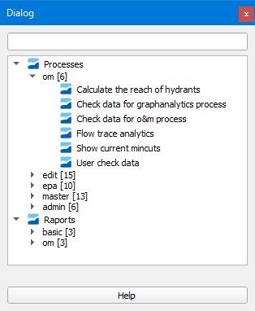
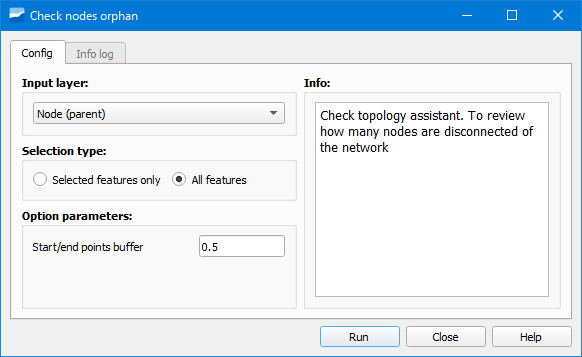
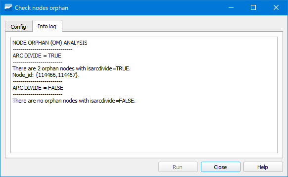

.. _toolbox:

================================
Caja de herramientas de Giswater
================================

.. only:: html

   .. contents::
      :local:

La caja de herramientas contiene un conjunto de procesos propios de Giswater con los cuales podemos, entre otras cosas, detectar y corregir errores de la red.

      Ventana de la Caja de herramientas de Giswater.

Al clicar sobre su botón se abrirá una ventana en la cual veremos que hay dos grandes grupos: *Procesos* y *Reportes*, cada uno de los cuales tiene unos subgrupos.

Dentro de *Procesos* encontraremos herramientas orientadas a operaciones y mantenimiento (*om*), edición (*edit*), simulación hidráulica (*epa*), gestión de alternativas (*master*) y administración de la red (*admin*).

Dentro de *Reportes* encontraremos herramientas orientadas a informes sobre aspectos básicos de la red (*basic*) y operaciones y mantenimiento (*om*).

Para ejecutar un proceso solo hay que hacer doble clic en su nombre en la caja de herramientas.

Cuadro de diálogo del proceso
=============================

Tras hacer doble clic sobre el proceso se abrirá un diálogo similar al mostrado en la siguiente figura.

      Diálogo del proceso Check nodes duplicated de un esquema ws.

El diálogo muestra dos pestañas a la izquierda (*Config* y *Info log*), la descripción del proceso a la derecha (*Info*) y un conjunto de botones en la parte inferior.

Pestaña *Config*
----------------

En esta pestaña debemos establecer los valores de entrada que el proceso necesita para ser ejecutado así como los parámetros de configuración que es necesario especificar.

Los valores de entrada van a depender del proceso que se esté ejecutando de tal manera que el cuadro de diálogo será distinto para cada proceso.

Pestaña *Info Log*
------------------

Muestra un resumen del proceso que se ha llevado a cabo.

      Ejemplo de resumen de un proceso.

Resultados del proceso
======================

La ejecución de ciertos procesos lleva pareja la creación de unas capas temporales con los resultados. Dichas capas se cargarán en el ToC en un grupo llamado *GW Temporal Layers* y su geometría va a depender 
de la geometría de la capa de entrada.

Para obtener información acerca de la capa resultante podremos abrir su tabla de atributos.
