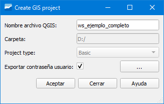
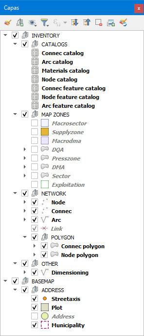
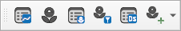
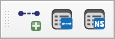
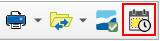
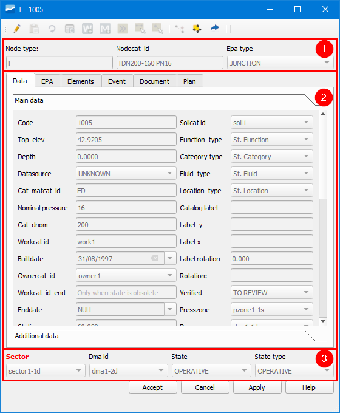

.. _work-environment:

==================
Work environment
==================

.. only:: html

   .. contents::
      :local:

How to create a schema and a work project
==============================================

Once we have installed the necessary software indicated in the :ref:`installation-start-up` section and we have created the connections following the steps in the :ref:`creation-previous-connections` section,
we can start working with Giswater.

The first thing we have to do is create a project schema. For this, **on a blank QGIS project**, we will click on the Giswater button to open the project manager window.

.. figure:: img/work-environment/project-manager.png

   Giswater project manager window.

As we can see, the window is divided into three parts:

- Connection: is the section where we must select the name of the connection with the database we want to use to work.
  In the case of having several, we can select the desired one in the corresponding dropdown.
- Project schema information: this section is formed by three parts. The first, *Project type*, allows us to select what type of project schema we want to create.
  The two available options are *ws* for supply projects and *ud* for sanitation and urban drainage projects. The second part, *Name*, indicates the name of the schema.
  When it appears blank it is because there is no schema created yet. In the case of having several, we can select one or the other in the dropdown.
  The third and last part is the one formed by a text box in which we will see information related to the created schema. Here we can consult information about the PostgreSQL,
  PostGis, schema name, EPSG... We also have four buttons available:

   - Update schema: button that allows us to update the work schema when we have installed a new version of Giswater, which does not coincide with the creation of the schema.
     It will only be enabled when the versions do not coincide.
   - Rename: button that allows us to rename the schema that we have selected in the *Name* dropdown.
   - Delete: button that allows us to delete the schema that we have selected in the *Name* dropdown.
   - Copy: button that allows us to copy the schema that we have selected in the *Name* dropdown.
  
- Schema management: section with two buttons which will allow us to create a new schema (*Create database project schema*) and create the QGIS project (*Create QGIS project file*).

Once we know the type of project schema to create (ws or ud), we will select it in the *Project type* dropdown, click on the *Create database project schema* button and the following window will open.

.. figure:: img/work-environment/create-schema.png

   New schema creation window.

This window serves to specify important aspects of our work schema as well as to create it. We will have to specify:

- Project type: type of project we are going to create (ws or ud).
- Language: language in which the schema will be created. We can choose one of the available in the dropdown.
  If we are going to create one of the available examples (*Example inventory* or *Example complete*) **we will have to select the English (USA) language**.
- Project name: we will indicate the name of the project schema. **It cannot contain uppercase letters**.
- Description: brief description of the project.
- Filter SRID: coordinate system of the zone where the schema will be created.
- Data source: we can select between:

    - No data: option selected to create a blank schema. It will be the option selected when we want to work with our network.
    - Example inventory: option selected to have an example schema **only with inventory data**.
    - Example complete: option selected to have an example schema with **complete data (inventory and EPA)**.

When we have specified all the data, we will click on the *Accept* button to start the schema creation.

Once the schema has been created, the schema creation window will disappear and we will see that now we have information about the schema in the text box.

Now, the only thing that is left is to create the QGIS project for this we will click on the *Create QGIS project file* button.

     
   QGIS project creation window.

In it we will have to specify:

- QGIS project name: name we want to give to the project. By default it takes the same name as the schema.
- Folder: path where the project will be saved. To be able to change the one that comes we will have to click on the button with three points and a window of the explorer will open.
- Export user password: checkbox that allows saving or not the database access password in the GIS file.

When we click on the *Accept* button the project will be created and opened.

.. warning::
  
   If we mark the *Export user password* checkbox the password will be saved in the QGIS project. If we share the project with another person **we will be sharing our password as well**.
   
   Extremar the precaution with the marking of this checkbox.

Table of contents (ToC)
=========================

Once we have the project loaded in QGIS, we see that in the ToC a series of layers have been loaded which are grouped by thematic.

   Layers of a ws project loaded in the ToC.

- *INVENTORY* group

In this group we are where we find the most important layers of the project since here we find the catalogs (*CATALOGS*), the map zones (*MAP ZONES*) and
the own layers of the network (*NETWORK*). There is also an additional group (*OTHER*) that contains other relevant layers.

- *BASEMAP* group

In this group we find the layers to represent the street axis (*Streetaxis*), the building polygon (*Plot*), the portal numbers (*Address*) and the municipal limit (*Municipality*).

Giswater incorporates two additional buttons to the ToC of QGIS: *Load Giswater layer* and *Giswater styles*.

*Load Giswater layer* allows us to select which layer we want to add to the project. They are grouped by themes and we can incorporate them by marking the corresponding checkbox.
We can also add catalogs and the DEM in the case that we have imported it to the database.

*Giswater styles* allows us to modify the style of the layers by selecting one of the available ones. As a consequence we will see that the network symbology is modified.

.. note::

   The styles of the layers can be modified according to the needs of the user. In such a case, to avoid losing the default Giswater symbology, it is recommended to create a new one
   and not modify the existing one.

Toolbars
======================

After opening a Giswater project, we see that we have some toolbars with buttons that allow us to perform different operations. Next, we will see one by one.

*Basic* toolbar
-----------------------------

   *Basic* toolbar.

*Basic* toolbar contains buttons to perform basic queries related to general aspects of the network. It contains the following buttons:

- Info Giswater: allows us to open the form of an object to consult its information. **To open it it is not necessary to have an active layer in the ToC**.
  It works like the *Identify object spatial* button of QGIS. For more details, see the section :doc:`../dialogs/info_feature/index`.

- Selector: allows us to filter the information we want to use in different scopes of the project. It is divided into several tabs each of which allows activating/deactivating the display of elements on the map.
  For more details, see the section :ref:`dialog-selector`.

- Searcher: allows us to perform different searches on different scopes of the project. It is divided into several tabs each of which allows performing a different search. 
  For more details, see the section :ref:`dialog-search`.

*OM* toolbar
--------------------------

.. figure:: img/work-environment/toolbar-om-ws.png

   *OM* toolbar for supply.

.. figure:: img/work-environment/toolbar-om-ud.png

   *OM* toolbar for sanitation and urban drainage.

*OM* toolbar contains buttons to perform management and processes related to operations and maintenance. It contains the following buttons:

- Cut polygon (ws): allows the calculation of a new cut polygon from the selection of a point on the network. For more details, see the section :ref:`dialog-mincut`.
- Cut polygon manager (ws): allows active management of planned, current and historical cut polygons. For more details, see the section :ref:`dialog-mincut-manage`.
- Flow tracing (ud): allows determining everything that is upstream of a established node. For the analysis to be successful, the network must have continuity and be digitalized
  in the direction of the water (from upstream to downstream). For more details, see the section :ref:`dialog-flow-trace`.
- Flow exit (ud): allows determining everything that is downstream of a established node. For the analysis to be successful, the network must have continuity and be digitalized
  in the direction of the water (from upstream to downstream). For more details, see the section :ref:`dialog-flow-exit`.
- Profile tool (ud): allows, by setting two nodes, to draw the longitudinal profile between them. For more details, see the section :ref:`dialog-profile-tool`.
- Add visit: allows adding a new visit and linking it to an element of the network. Each visit can have several information parameters. For more details, see the section :ref:`dialog-add-visit`.
- Visit manager: allows managing the existing visits. For more details, see the section :ref:`dialog-manage-visit`.
- Date selector: allows setting an initial and final date that will be useful to use in case of having filtered queries by this selector. For more details, see the section :ref:`dialog-date-selector`.

*Edit* toolbar
----------------------------

   *Edit* toolbar.

*Edit* toolbar contains buttons to perform editing works of the network. It contains the following buttons:

- Insert point: allows inserting a new point element of the network (node/connec/gully). For more details, see the section :ref:`digitalization`.
- Insert arc: allows inserting a new line element of the network (arc/link). For more details, see the section :ref:`digitalization`.
- Divide arc: allows dividing an existing segment with a node, generating two new segments. For more details, see the section :ref:`dialog-arc-divide`.
- Fusion arc: allows merging two existing segments into a single segment. For more details, see the section :ref:`dialog-arc-fusion`.
- Change element type: allows changing the type of element of an object of the network by another of a different type. The change can be made between arcs, nodes, connecs or gullys
  For more details, see the section :ref:`dialog-change-featuretype`.
- Replace object: allows substituting a node, arc or connec by a new one without affecting the topology. For more details, see the section :ref:`dialog-replace-feature`.
- Connect to the network: allows drawing automatically the links between connec/gully and arc. For more details, see the section :ref:`dialog-connect-to-net`.
- End feature: allows changing to the *Obsolete* state one or more elements of the network. For more details, see the section :ref:`dialog-end-feature`.
- Delete element of network: allows deleting a network element in a definitive way. For more details, see the section :ref:`dialog-delete-feature`.
- Dimensioning: allows drawing dimensioning of reference and support on the map. For more details, see the section :ref:`dialog-dimensioning`.
- Add document: allows linking any type of document with the elements of the network. For more details, see the section :ref:`dialog-add-doc`.
- Document manager: allows managing the documents linked with the elements of the network. For more details, see the section :ref:`dialog-manage-docs`.
- Add element: allows linking non-topological associated elements with the objects of the network. For more details, see the section :ref:`dialog-add-element`.
- Element manager: allows managing the associated elements with the objects of the network. For more details, see the section :ref:`dialog-manage-element`.
- Create circle: allows drawing support circles to be able to digitalize with precision. For more details, see the section :ref:`dialog-create-circle`.
- Create point: allows drawing support points to be able to digitalize with precision. For more details, see the section :ref:`dialog-create-point`.

*Epa* toolbar
---------------------------

   *Epa* toolbar.

*Epa* toolbar contains buttons related to the hydraulic model. It contains the following buttons:

- Non-visual objects manager: allows managing the non-visual objects necessary for the hydraulic model. We can duplicate, create and delete them. Depending on the type of project (ws or ud)
  gestionaremos unos u others. For more details, see the section :ref:`dialog-non-visual-obj`.
- Go2Epa: allows setting the export options for the hydraulic models as well as if the network is simulated from the Giswater environment. For more details, see the section :ref:`dialog-go2epa`.
- Epa results manager: allows visualizing all the results of the simulations performed in Giswater. For more details, see the section :ref:`dialog-result-manager`.
- Epa results selector: allows selecting what results to show as well as comparing the results of a simulation with another. For more details, see the section :ref:`dialog-result-selector`.
- Dynamic scenarios manager: allows creating and managing dynamic scenarios. Depending on the type of work project (ws or ud) we will have available some or other options.
  For more details, see the section :ref:`dialog-dscenario-manager`.
- EPA tools: set of tools intended for the management of the hydraulic simulation. Depending on the type of work project (ws or ud) we will have available some or other tools.
  For more details, see the section :ref:`dialog-epa-tools`.

*Masterplan* toolbar
----------------------------------

   *Masterplan* toolbar.

*Masterplan* toolbar contains buttons related to the planning works of the network. It contains the following buttons:

- New planning sector: allows creating a new psector. For more details, see the section :ref:`dialog-new-psector`.
- Planning sector manager: allows performing management operations on the psector such as creating, merging, duplicating and deleting. For more details, see the section :ref:`dialog-psector-management`.
- Network scenarios manager: allows planning scenarios on the network to perform changes in the map zones and optimize them. For more details, see the section :ref:`dialog-netscenarios`.

*Utilities* toolbar
----------------------------------

.. figure:: img/work-environment/toolbar-utilities.png

   *Utilities* toolbar.

*Utilities* toolbar contains buttons related to general aspects of the project. It contains the following buttons:

- Utilities manager: incorporates several functionalities among which it is worth highlighting the map zone manager. For more details, see the section :ref:`dialog-utils-manager`.
- Configuration: allows configuring different variables and default values for the user/system. For more details, see the section :ref:`dialog-config`.
- Toolbox: contains processes and reports that allow, among other things, detecting and correcting errors in the network. For more details, see the section :ref:`toolbox`.
- Workspace: allows creating work environments whose configuration can be recovered. For more details, see the section :ref:`dialog-workspace`.
- Quick print: allows easily extracting a map using available compositions in QGIS. For more details, see the section :ref:`dialog-fastprint`.
- GW file transfer button: allows importing data from csv files using preconfigured functions. For more details, see the section :ref:`dialog-gwfiletransferbutton`.
- Verify project: executes different processes to show a detailed summary of the health status of the project. For more details, see the section :ref:`dialog-check-project`.

*Audit* toolbar
-----------------------------

   Temporal recovery tool for the network state, embedded in the Utilities toolbar.

.. figure:: img/work-environment/toolbar-audit-customform.png

   Inspection of changes tool, embedded in the forms of the network objects.

The audit tools, Audit, are subscribed to the called **audit** module of Giswater, which has the objective of being a traceability and audit mechanism within the GIS, registering all the changes made over time and allowing access to them at any time, in a simple way and embedded in QGIS as Giswater's own tools.

For more details on the launch, management and operation of the module, see the section :ref:`additional-toolbars-audit`

- Temporal recovery of the network state: allows reconstructing the historical state of the network in the selected extension and date in a precise manner. The user will be able to see in temporal tables the state of the network during the selected date. Through categorized symbology it will be possible to compare if the object has been modified or deleted with respect to the current date.
- Inspection of changes: allows consulting all the modifications registered (and audited) on the object in question, presenting the results in an additional form. This list of versions, ordered chronologically, allows examining the complete evolution of the object over time.

*Campaign manage* toolbar
---------------------------------------

*Asset manage* toolbar
------------------------------------

.. figure:: img/entorno-trabajo/toolbar-asset-manage.png

   *Asset manage* toolbar.

*Asset manage* toolbar contains buttons related to the management of assets. It contains the following buttons:

- Administrative tool: allows grouping several advanced functionalities related to the management of the network. Includes the assignment of leaks and the priority calculation (Global). For more details, see the section :ref:`dialog-am-administrative-tool`.
- Priority calculation by selection: allows executing the priority calculation directly on the selection of elements or on the defined sets. For more details, see the section :ref:`dialog-am-prioirity-calculation-by-selection`.
- Result manager: provides a centralized access to the results generated by the different processes, facilitating their consultation, organization and export. For more details, see the section :ref:`dialog-am-result-manager`.
- Result selector: allows filtering and selecting the available results quickly, optimizing the review and comparison of scenarios. For more details, see the section :ref:`dialog-am-result-selector`.

Elements forms
============================

Each of the network objects defined in the *cat_feature_* catalogs has a form associated in which the common fields of the element type are displayed.
This is why the forms are quite similar to each other but, as there are also specific fields for each type, there are certain differences.

These forms can be customized so that we can set which fields we want to see, which labels to display and in what color, what position they occupy within the form...
As they are unique for each object, the level of customization is such that we can make each form different from the others.

The way to visualize it is through the *Info Giswater* button and it works for nodes, arcs, connecs, gullys, visits and dimensionings.

.. _form-parts:

Forms parts
---------------------

They are formed by three parts or layouts: the upper (1), the central (2) and the lower (3).

Both the upper and the lower will always be visible while the information shown in the middle will be different depending on the object we are consulting and the tab we are visualizing.

   Example of form of a node of the supply network.

In the upper part we find the widgets that refer to the type of object (*Node type*) and its specific catalog (*Nodecat_id*), as well as the EPA type (*Epa type*).

In the middle part we find the information of each object organized by tabs.

In the lower part we find information about map zones (*Sector* and *Dma id*) as well as its state (*State*) and state type (*State type*).

Next, using the form of the previous image, we will describe the tabs contained in the middle part.

.. note::

   Although the form of a network object of the supply network is used as a reference, the tabs of the objects of both types of networks are explained.
    
- Data: contains the data of all the attributes of the object, both the common ones of its type as well as the specific ones of the type of object. It is the most important tab. Depending on the object consulted we will see some data or others.
- EPA: refers to the specific data of the EPA world (hydraulic simulation) and will change depending on the EPA type of the element. It consists of two columns. The INP is used to introduce the data
  necessary for the model and the RPT shows the results of the simulation.
- Conections (ud): tab available **only for nodes**. We will see that there are two parts. The upper part will show all the arcs that are upstream of the node (*Upstream features*)
  and the lower part will show all the arcs that are downstream of the node (*Downstream features*).
- Elements: contains information about the associated elements that the object may have. In the case of having associated elements a table with the corresponding data will be seen.
  Above the table there are several buttons that will allow us to link or unlink existing elements, add new elements or open the data in a floating form.
- Relations: tab available **only for arcs**. We will see a table with the network objects that are connected to the segment (connecs or gullys).
- Hydrometer: tab available **only for connecs** where we will see a table with the list of subscribers associated with the meter.
- Hydrometer values: tab available **only for connecs** that serves to consult the consumptions of the subscribers where we can filter by period and code.
- Event: as with the elements, a table with data of the events that have happened over time on our object will be shown.
  These events refer to all the parameters that have been registered in a visit and we will see information about the date, the type of parameter and its value
  as well as other data related to the visit. The available buttons allow opening the visit manager, adding a new visit, showing the image related to the event or opening its data in a floating form.
  In some cases, this tab is replaced by a called *Visit* which instead of showing the events in table format, shows them in line format having columns for each event.
- Document: in it we will see all the documents linked to the object where the most important is the right button, since it allows opening the path and visualizing the selected document.
- Plan: refers to the price of the object and will show a list of the costs that the element would have in the case of being renewed.
  This is especially interesting in the case of arcs, since they have many more variables to consider (soil type, excavation, transport to landfill...).
  To be able to visualize these prices, the *plan_price*, *cat_soil*, *cat_pavement* catalogs have to be completed and the values of *soilcat_id* and *pavcat_id* have to be assigned to the arc layer.

