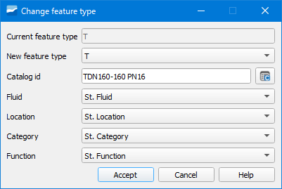

===============
Botón Change Feature Type
===============

Herramienta que permite cambiar el tipo de elemento de un objeto de la red por otro de un tipo distinto.
El cambio lo podemos hacer entre arcos, nodos y connecs. Una vez seleccionado el elemento a cambiar, en la ventana emergente obligatoriamente deberemos especificar:

   Ventana de la herramienta Change feature type.

- Current feature type: tipo de elemento actual. Se selecciona por defecto.
- New feature type: tipo de elemento al cual queremos cambiar. Seleccionaremos uno en el desplegable. 
  Tendremos disponibles todos aquellos que en el "Node feature catalog" tengan el valor *verdadero* en el campo *active*.
- Catalog id: catálogo del nuevo elemento. Pinchando en el botón adyacente se abrirá una ventana donde especificaremos:
  
.. figure:: img/change_feature_type_catalog.png

    Ventana para cambiar el catálogo al nuevo elemento.

- Material: material del elemento.
- Pn: presión nominal del elemento.
- Dn: diámetro nominal del elemento.
- Id: identificador del elemento.

Además, si disponemos de información acerca del tipo de fluido, localización, categoría y función podremos seleccionarlo en Fluid, Location, Category y Function.
