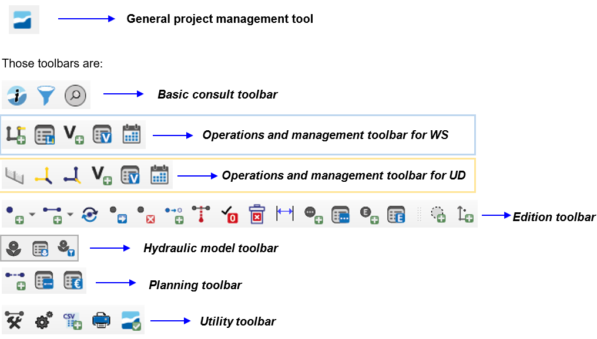

===============
Giswater Plugin
===============

Una de las mejoras más grandes y notables de la cuarta versión de Giswater, en comparación con las versiones anteriores,
se puede encontrar en las herramientas del plugin. No solo se han añadido nuevas capacidades, sino que las herramientas existentes se han mejorado una a una.

El plugin de Giswater es la parte del software con la que el usuario debe familiarizarse más,
ya que la mayoría de las acciones que desea realizar se pueden hacer utilizando las herramientas disponibles en el plugin.
De una manera u otra, todo lo que desee hacer en su red se puede realizar utilizando el plugin y los botones que incorpora.

Actualmente, Giswater tiene hasta 38 herramientas disponibles, divididas en diferentes barras de herramientas que deben asociarse con los seis roles que existen en Giswater.
Además de estas herramientas de gestión dentro de los proyectos, a partir de la versión 3.1.105, se ha incorporado un botón que incluye las funcionalidades de crear,
modificar y actualizar esquemas.

Botón aparte de las barras de herramientas del plugin:

A continuación se detallará la funcionalidad y objetivo de cada una de las herramientas.

.. TODO: Añadir cada sección separada con su toctree

.. toctree::
   :maxdepth: 2
   :caption: Botones de edición

   change-feature-type
